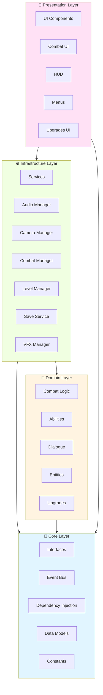
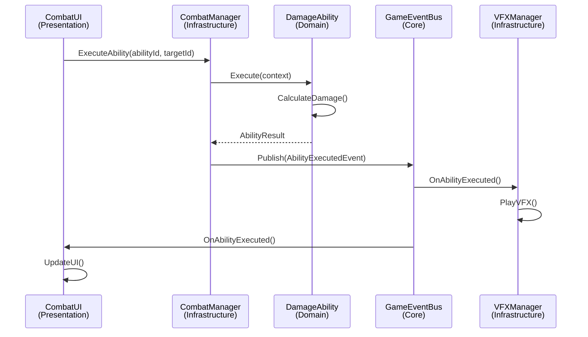

# 🏗️ Arquitectura del Proyecto Santa

## Visión General

El proyecto Santa sigue los principios de **Clean Architecture** combinados con **SOLID** y patrones de diseño modernos para Unity. La arquitectura está diseñada para ser:

- **Mantenible**: Código organizado y fácil de entender
- **Testeable**: Dependencias inyectables y lógica desacoplada
- **Escalable**: Fácil de extender con nuevas características
- **Performante**: Optimizado para 60 FPS en dispositivos móviles

## 📊 Diagrama de Arquitectura



## 🔄 Capas de la Arquitectura

### 1️⃣ Core Layer (Núcleo)

**Ubicación**: `Assets/Scripts/Core/`

**Propósito**: Define contratos, modelos compartidos y servicios fundamentales.

#### Componentes Principales:

- **Interfaces** (`Core/Interfaces/`)
  - Contratos para todos los servicios principales
  - Ejemplo: `ICombatService`, `IUIManager`, `ISaveService`
  
- **Events** (`Core/Events/`)
  - Event Bus centralizado (`GameEventBus`)
  - Eventos del juego: `CombatEvents`, `GameEvents`, `VFXEvents`
  
- **Dependency Injection** (`Core/DI/`)
  - `GameLifetimeScope` - Configuración principal de VContainer
  - Registro de servicios y lifetime management
  
- **Models** (`Core/`)
  - `HealthComponent`, `ActionPointComponent`, `StatComponent`
  - `LevelData`, `PlayerStatsConfig`, `CombatArenaSettings`
  
- **Constants** (`Core/Constants/`)
  - `GameConstants` - Constantes del juego
  - `AddressableKeys` - Claves de Addressables
  - `UIStrings`, `UIColors`

#### Responsabilidades:
- ✅ Definir interfaces y contratos
- ✅ Proporcionar modelos de datos compartidos
- ✅ Gestionar eventos del sistema
- ✅ Configurar Dependency Injection
- ❌ **NO** contiene lógica de negocio
- ❌ **NO** contiene implementaciones concretas de servicios

---

### 2️⃣ Domain Layer (Dominio)

**Ubicación**: `Assets/Scripts/Domain/`

**Propósito**: Contiene la lógica de negocio pura del juego.

#### Componentes Principales:

```
Domain/
├── Combat/              # Lógica de combate
│   ├── Abilities/       # Sistema de habilidades
│   ├── States/          # Estados de combate
│   ├── Targeting/       # Sistema de targeting
│   └── Data/            # DTOs y modelos de combate
├── Dialogue/            # Sistema de diálogos
├── Entities/            # Entidades del juego
├── Player/              # Lógica del jugador
└── Upgrades/            # Sistema de mejoras
```

#### Responsabilidades:
- ✅ Lógica de negocio pura (independiente de Unity)
- ✅ Reglas del juego y validaciones
- ✅ Cálculos de combate, damage, stats
- ✅ Definición de abilities y sus efectos
- ❌ **NO** depende de MonoBehaviours
- ❌ **NO** maneja persistencia directamente
- ❌ **NO** contiene código de UI

#### Ejemplo: Sistema de Abilities

```csharp
// Domain Layer - Lógica pura
public abstract class Ability
{
    public abstract AbilityResult Execute(AbilityContext context);
    public abstract bool CanExecute(AbilityContext context);
}

public class DamageAbility : Ability
{
    public override AbilityResult Execute(AbilityContext context)
    {
        int damage = CalculateDamage(context);
        context.Target.TakeDamage(damage);
        return new AbilityResult { Success = true, Damage = damage };
    }
}
```

---

### 3️⃣ Infrastructure Layer (Infraestructura)

**Ubicación**: `Assets/Scripts/Infrastructure/`

**Propósito**: Implementaciones concretas de servicios que interactúan con frameworks externos.

#### Componentes Principales:

```
Infrastructure/
├── Audio/               # Implementación de audio
│   └── AudioManager.cs
├── Camera/              # Gestión de cámaras
│   └── CombatCameraManager.cs
├── Combat/              # Implementación de combate
│   ├── TurnBasedCombatManager.cs
│   ├── CombatStateManager.cs
│   ├── CombatEncounterManager.cs
│   └── AIManager.cs
├── Input/               # Input handling
│   └── InputReader.cs
├── Level/               # Gestión de niveles
│   └── LevelManager.cs
├── Save/                # Sistema de guardado
│   ├── SaveService.cs
│   ├── SecureStorageService.cs
│   └── Contributors/
├── State/               # Gestión de estado
│   └── GameStateManager.cs
└── VFX/                 # Efectos visuales
    └── VFXManager.cs
```

#### Responsabilidades:
- ✅ Implementar interfaces de Core
- ✅ Interactuar con Unity APIs (MonoBehaviours)
- ✅ Gestionar assets via Addressables
- ✅ Persistencia y almacenamiento
- ✅ Input handling
- ❌ **NO** contiene lógica de negocio compleja
- ❌ **NO** accede directamente a UI

#### Ejemplo: Service Implementation

```csharp
// Infrastructure Layer - Implementación concreta
public class TurnBasedCombatManager : MonoBehaviour, ICombatService
{
    [Inject] private ICombatStateManager _stateManager;
    [Inject] private IEventBus _eventBus;
    
    public async UniTask StartCombat(CombatConfig config)
    {
        // Implementación usando Unity APIs
        await _stateManager.TransitionTo(CombatPhase.Setup);
        _eventBus.Publish(new CombatStartedEvent());
    }
}
```

---

### 4️⃣ Presentation Layer (Presentación)

**Ubicación**: `Assets/Scripts/Presentation/`

**Propósito**: Todo lo relacionado con UI y presentación visual.

#### Componentes Principales:

```
Presentation/
├── Combat/              # UI de combate
│   ├── CombatUI.cs
│   ├── CombatUIActionButtons.cs
│   └── CombatLogUI.cs
├── HUD/                 # HUD de exploración
│   ├── HealthBarUI.cs
│   └── VirtualPauseButton.cs
├── Managers/            # Gestores de UI
│   ├── UIManager.cs
│   └── GameplayUIManager.cs
├── Menus/               # Menús del juego
│   ├── PauseMenuController.cs
│   └── GraphicsSettingsManager.cs
└── Upgrades/            # UI de upgrades
    ├── UpgradeManager.cs
    └── UpgradeUILoader.cs
```

#### Responsabilidades:
- ✅ Renderizar UI y feedback visual
- ✅ Gestionar panels via Addressables
- ✅ Interpretar input del usuario
- ✅ Actualizar visualizaciones basadas en eventos
- ❌ **NO** contiene lógica de negocio
- ❌ **NO** accede directamente a datos (usa servicios)

---

## 🔌 Dependency Injection con VContainer

### GameLifetimeScope

El `GameLifetimeScope` es el contenedor principal de DI que:

1. **Registra servicios** como singletons o por instancia
2. **Inyecta dependencias** automáticamente
3. **Gestiona lifecycle** de componentes

```csharp
protected override void Configure(IContainerBuilder builder)
{
    // Registrar servicios
    RegisterService<ICombatService, TurnBasedCombatManager>(builder, turnBasedCombatManagerInstance);
    RegisterService<IUIManager, UIManager>(builder, uiManagerInstance);
    
    // Event Bus como singleton
    builder.Register<GameEventBus>(Lifetime.Singleton).As<IEventBus>();
    
    // Componentes de jerarquía
    TryRegisterOptionalComponent<PlayerReference>(builder);
}
```

### Patrón de Inyección

```csharp
public class ExampleService : MonoBehaviour
{
    private ICombatService _combatService;
    private IEventBus _eventBus;
    
    [Inject]
    public void Construct(ICombatService combatService, IEventBus eventBus)
    {
        _combatService = combatService;
        _eventBus = eventBus;
    }
}
```

---

## 📡 Event-Driven Communication

### GameEventBus

Sistema centralizado de eventos que permite comunicación desacoplada entre sistemas.

```csharp
// Publicar evento
_eventBus.Publish(new CombatStartedEvent { EnemyId = enemyId });

// Suscribirse a evento
_eventBus.Subscribe<CombatStartedEvent>(OnCombatStarted);

// Limpiar suscripción
_eventBus.Unsubscribe<CombatStartedEvent>(OnCombatStarted);
```

### Eventos Principales

- **CombatEvents**: `CombatStartedEvent`, `TurnStartedEvent`, `AbilityExecutedEvent`
- **GameEvents**: `GameStateChangedEvent`, `LevelLoadedEvent`
- **VFXEvents**: `VFXCompletedEvent`
- **DayNightEvents**: `DayNightCycleEvent`

---

## 🎯 Patrones de Diseño Utilizados

### 1. **Service Pattern**
Todos los servicios principales implementan interfaces:
- `ICombatService` → `TurnBasedCombatManager`
- `IUIManager` → `UIManager`
- `ISaveService` → `SaveService`

### 2. **Observer Pattern**
Implementado via `GameEventBus` para comunicación desacoplada.

### 3. **Strategy Pattern**
Sistema de abilities usa strategy para diferentes tipos de acciones.

### 4. **State Pattern**
`CombatStateManager` gestiona estados del combate (Setup, PlayerTurn, EnemyTurn, etc.)

### 5. **Object Pool Pattern**
`PoolService` para VFX, projectiles y elementos reutilizables.

### 6. **Factory Pattern**
Addressables actúa como factory para instantiación dinámica de prefabs.

### 7. **Repository Pattern**
`SaveService` con `SaveContributorRegistry` actúa como repository.

---

## 🔐 Principios SOLID

### Single Responsibility Principle (SRP)
Cada clase tiene una única razón para cambiar.
- `HealthComponent` solo gestiona salud
- `ActionPointComponent` solo gestiona puntos de acción

### Open/Closed Principle (OCP)
Abierto para extensión, cerrado para modificación.
- Nuevas abilities extienden `Ability` sin modificar código existente

### Liskov Substitution Principle (LSP)
Las implementaciones son intercambiables con sus interfaces.
- Cualquier `ICombatService` puede reemplazar a otro

### Interface Segregation Principle (ISP)
Interfaces específicas en lugar de generales.
- `IHealthController`, `IActionPointController` vs una interfaz monolítica

### Dependency Inversion Principle (DIP)
Depender de abstracciones, no de concreciones.
- Todos los servicios inyectan interfaces, no implementaciones concretas

---

## 📦 Asset Management con Addressables

### Estructura de Addressables

```
Addressables/
├── UI/
│   ├── Panels/          # CombatUI, UpgradeUI, PauseMenu
│   └── Elements/        # Botones, headers, etc.
├── Combat/
│   ├── Arenas/          # Escenas de combate
│   └── VFX/             # Efectos visuales
└── Audio/
    ├── Music/
    └── SFX/
```

### Carga Dinámica

```csharp
// En UIManager
public async UniTask ShowPanel(string addressableKey)
{
    var handle = Addressables.InstantiateAsync(addressableKey);
    GameObject panel = await handle.Task;
    // Gestionar panel...
}
```

### Ventajas
- ✅ Reduce memoria inicial
- ✅ Facilita actualizaciones remotas
- ✅ Mejora tiempos de carga
- ✅ Permite contenido dinámico

---

## 🚀 Performance Optimizations

### 1. UniTask - Zero Allocation Async
```csharp
// ❌ Evitar (genera GC)
public async Task LoadLevel() { }

// ✅ Usar (zero allocation)
public async UniTask LoadLevel() { }
public UniTaskVoid LoadLevelFireAndForget() { }
```

### 2. Object Pooling
```csharp
// Usar PoolService para objetos frecuentes
var vfx = await _poolService.Get(vfxKey);
// ... usar VFX ...
_poolService.Return(vfxKey, vfx);
```

### 3. LINQ-Free Hot Paths
```csharp
// ❌ Evitar en Update/FixedUpdate
var enemies = allEntities.Where(e => e.IsEnemy).ToList();

// ✅ Usar loops tradicionales
for (int i = 0; i < allEntities.Length; i++)
{
    if (allEntities[i].IsEnemy) { }
}
```

---

## 📝 Convenciones de Código

### Namespaces
```csharp
Santa.Core.*           // Interfaces, eventos, modelos
Santa.Domain.*         // Lógica de negocio
Santa.Infrastructure.* // Implementaciones de servicios
Santa.Presentation.*   // UI y presentación
```

### Naming
- **Interfaces**: `IServiceName`
- **Services**: `ServiceNameManager` o `ServiceName`
- **Events**: `EventNameEvent`
- **Data Models**: `ModelName` (sin sufijos)

### File Organization
- Un archivo por clase principal
- Archivos nombrados igual que la clase pública que contienen
- Clases helper/internas pueden estar en el mismo archivo

---

## 🔄 Flujo de una Acción Típica

Ejemplo: **Jugador ejecuta una ability en combate**



---

## 🎓 Mejores Prácticas

### ✅ DO's
- Inyectar dependencias via constructor/método Inject
- Usar UniTask para operaciones asíncronas
- Publicar eventos para comunicación entre sistemas
- Mantener lógica de negocio en Domain
- Usar interfaces para todo servicio público
- Poolear objetos frecuentemente instanciados
- Mantener MonoBehaviours ligeros (delegar a servicios)

### ❌ DON'Ts
- No usar FindObjectOfType en hot paths
- No usar LINQ en Update/FixedUpdate
- No acoplar sistemas directamente (usar interfaces)
- No poner lógica de negocio en MonoBehaviours
- No usar singletons estáticos (usar DI)
- No acceder a UI desde Domain o Core

---

## 📚 Referencias

- [Clean Architecture (Robert C. Martin)](https://blog.cleancoder.com/uncle-bob/2012/08/13/the-clean-architecture.html)
- [SOLID Principles](https://en.wikipedia.org/wiki/SOLID)
- [VContainer Documentation](https://vcontainer.hadashikick.jp/)
- [UniTask Documentation](https://github.com/Cysharp/UniTask)
- [Unity Addressables](https://docs.unity3d.com/Packages/com.unity.addressables@latest)

---

**Última actualización**: Enero 2026
