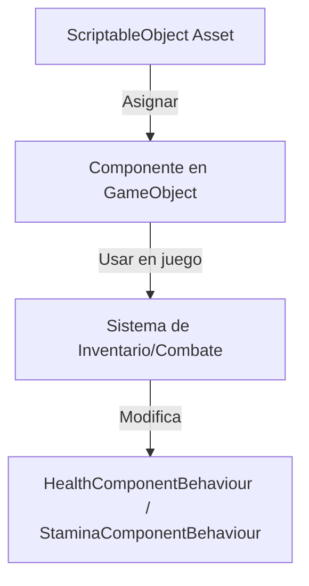

# Documentación del Proyecto Unity: Manual de Clases, Métodos y Variables

> **¡Bienvenido!** Esta documentación está pensada para quienes están comenzando en Unity. Aquí encontrarás explicaciones claras, ejemplos comentados y advertencias para evitar errores comunes. Si tienes dudas sobre cómo asignar scripts o configurar objetos, consulta también el `MANUAL_DE_ASIGNACIONES.md`.

---

## Guía rápida para principiantes

Esta sección te ayudará a entender la arquitectura general del proyecto y a evitar los errores más comunes.

### Mini-diagrama visual de flujo



---

### Tabla de dependencias

| Sistema/Componente                | Depende de...                        | Asignar en...                      |
|-----------------------------------|--------------------------------------|------------------------------------|
| PlayerInventory                   | WeaponItem, HealingItem, MysteryItem | Inspector del jugador              |
| WeaponItem                        | WeaponHitbox prefab, HealthComponentBehaviour | ScriptableObject, Prefab         |
| HealingItem                       | HealthComponentBehaviour             | ScriptableObject, PlayerInventory  |
| CombatTransferData                | Prefabs, datos temporales            | CombatSceneLoader, CombatSceneInitializer |
| AttackComponent                   | WeaponItem, Animator                 | Jugador/Enemigo                    |

---

### Errores frecuentes y soluciones

| Error / Síntoma                        | Causa probable                                      | Solución rápida                                      |
|----------------------------------------|-----------------------------------------------------|------------------------------------------------------|
| NullReferenceException                 | Asset o campo no asignado                           | Asigna el asset en el Inspector                      |
| No puedes arrastrar el asset           | Campo en Inspector de tipo incorrecto               | Revisa el tipo del campo y el `[CreateAssetMenu]`    |
| No aparece opción de crear asset       | Falta `[CreateAssetMenu]` en el script              | Agrega `[CreateAssetMenu]` al ScriptableObject       |
| Cambios en asset no se reflejan        | Asset duplicado o no se guarda                      | Usa un solo asset y guarda los cambios               |
| Inspector no muestra campos            | ScriptableObject mal serializado                    | Marca campos como [SerializeField]                   |
| El arma no hace daño o no colisiona    | Prefab de hitbox incorrecto o sin WeaponHitbox      | Asigna prefab correcto y revisa el colisionador      |
| El ítem no se puede usar               | No implementa IUsableItem o no está en ItemDatabase | Implementa interfaz y registra en ItemDatabase       |
| No transfiere datos entre escenas      | ScriptableObject no asignado                        | Asigna el asset en los componentes de transferencia  |

---

### Preguntas frecuentes (FAQ)

**¿Puedo modificar la vida directamente desde un Script?**
>No. Siempre usa los behaviours (`HealthComponentBehaviour` o `StaminaComponentBehaviour`).

**¿Por qué no aparece mi ScriptableObject en el menú de creación?**
>Verifica que el script tenga `[CreateAssetMenu]`.

**¿Puedo compartir un mismo ScriptableObject entre varios objetos?**
>Sí, esa es la principal ventaja: reutilización y consistencia de datos.

**¿Qué hago si el asset no funciona como espero?**
>Revisa la tabla de errores frecuentes y asegúrate de que todo esté asignado correctamente.

**¿Dónde encuentro más ayuda?**
>Consulta el archivo `MANUAL_DE_ASIGNACIONES.md` para pasos de asignación en escenas y el `MANUAL_SCRIPTABLEOBJECTS.md` para el uso detallado de ScriptableObjects.

---

### Referencias cruzadas

- [Manual de Asignaciones](MANUAL_DE_ASIGNACIONES.md): Guía paso a paso para asignar scripts y assets en escenas.
- [Manual de ScriptableObjects](MANUAL_SCRIPTABLEOBJECTS.md): Guía visual y detallada para crear y usar ScriptableObjects.

---

## Índice
1. [Clases Principales](#clases-principales)
2. [Manual de Métodos](#manual-de-métodos)
3. [Manual de Variables](#manual-de-variables)
4. [Sistema de Inventario e Ítems Usables](#sistema-de-inventario-e-items-usables)
5. [Sistema de Armas, Durabilidad y Maestría](#sistema-de-armas-durabilidad-y-maestria)
6. [Eventos, Extensibilidad y Arquitectura Global](#eventos-extensibilidad-y-arquitectura-global)
7. [Buenas Prácticas y Seguridad](#buenas-practicas-y-seguridad)
8. [Ejemplos de Uso](#ejemplos-de-uso)
9. [Diagrama de Arquitectura](#diagrama-de-arquitectura)

---


## Clases Principales

> **¿Qué es una clase?**
> Una clase es como un plano o receta que define el comportamiento y los datos de un objeto en el juego. Los scripts en Unity suelen ser clases que se asignan a GameObjects.

### ProyectSecret.Components.HealthComponentBehaviour y ProyectSecret.Components.StaminaComponentBehaviour

**¿Para qué sirven?**
- Permiten que cualquier GameObject (jugador, enemigo, objeto destruible) tenga vida o stamina.
- Son la única forma recomendada de modificar vida y stamina desde otros scripts.
- **HealthComponentBehaviour**: Componente MonoBehaviour que gestiona la vida de cualquier entidad (jugador, enemigo, objeto destruible). Debe ser añadido al GameObject y expone la estadística de vida editable desde el Inspector.
- **StaminaComponentBehaviour**: Igual que el anterior, pero para la stamina (usualmente solo en el jugador).

> **Acceso universal:**
> Siempre usa:
> ```csharp
> var health = GetComponent<HealthComponentBehaviour>();
> if (health != null) health.Health.AffectValue(-10); // Aplica daño
> ```
> Nunca accedas directamente a `HealthComponent` o `StaminaComponent` desde otros scripts.

#### Firma de clases y miembros clave (ejemplos)

HealthComponentBehaviour (resumen):

```csharp
public class HealthComponentBehaviour : MonoBehaviour {
    [SerializeField] private float maxHealth = 100f;
    public HealthStat Health { get; private set; }
    public event Action OnDeath;

    void Awake() {
        // Inicializa Health
    }

    public void ApplyDamage(float amount) {
        Health.AffectValue(-amount);
        if (Health.CurrentValue <= 0) OnDeath?.Invoke();
    }
}

public class HealthStat {
    public float MaxValue;
    public float CurrentValue;
    public void AffectValue(float delta) { CurrentValue = Mathf.Clamp(CurrentValue + delta, 0, MaxValue); }
}
```

### ProyectSecret.Characters.HealthControllerBase

**¿Para qué sirve?**
- Es una clase base para controladores de salud (jugador, enemigos, objetos destruibles).
- Asegura que siempre se use el wrapper `HealthComponentBehaviour`.
- Clase base para controladores de salud (jugador, enemigos, objetos destruibles).
- Accede a la vida a través de `HealthComponentBehaviour`.
- Cualquier entidad que herede de esta clase debe tener el componente `HealthComponentBehaviour`.

### ProyectSecret.Combat.Behaviours.AttackComponent

**¿Para qué sirve?**
- Gestiona el ataque del jugador o enemigos y el consumo de stamina.
- Usa `StaminaComponentBehaviour` para consumir stamina al atacar.
- Ejemplo de uso:
```csharp
var staminaBehaviour = GetComponent<StaminaComponentBehaviour>();
if (staminaBehaviour != null && staminaBehaviour.Stamina.CurrentStamina >= staminaCost) {
    staminaBehaviour.Stamina.UseStamina(staminaCost);
}
```

AttackComponent (resumen de API):

```csharp
public class AttackComponent : MonoBehaviour {
    [SerializeField] private WeaponItem defaultWeapon;
    [SerializeField] private int staminaCost = 5;
    public bool TryAttack() {
        // Comprueba stamina, activa hitbox y devuelve true si se ejecutó
    }
}
```

Notas de integración:
- El `AttackComponent` normalmente llama a `PlayerEquipmentController` para obtener la `WeaponInstance` activa.
- Aconsejable: que `AttackComponent` exponga eventos `OnAttackStarted`, `OnAttackHit`, `OnAttackEnded` para que VFX y SFX se sincronicen.

### ProyectSecret.Areas.Damage.AreaDamage y AreaDamageTimer

**¿Para qué sirven?**
- Permiten que áreas del escenario apliquen daño automáticamente a quien entre en ellas.
- Usan `HealthComponentBehaviour` para aplicar daño a cualquier objeto que entre en el área.
- Ejemplo de uso:
```csharp
var healthBehaviour = other.GetComponent<HealthComponentBehaviour>();
if (healthBehaviour != null) {
    healthBehaviour.Health.AffectValue(-damage);
}
```

---

## Cambios recientes y mejores prácticas

> **Importante:**
> - El sistema de ataque es modular y fácil de conectar con animaciones.
> - Toda la lógica de armas está centralizada en `WeaponItem` y sus instancias.
> - Usa siempre los métodos públicos y wrappers para modificar vida, stamina, inventario y equipamiento.
> - Consulta el `MANUAL_DE_ASIGNACIONES.md` para saber dónde y cómo asignar cada script.
- El sistema de ataque es completamente modular y basado en colisionadores (hitboxes), facilitando la integración con animaciones y efectos visuales.
- Se eliminaron scripts y campos obsoletos (como `attackRange` y raycasts en ataques).
- Toda la lógica de armas está centralizada en `WeaponItem` y sus instancias.
- Documentación y manuales actualizados para principiantes y para reflejar la arquitectura moderna del proyecto.

### GameEventBus (Event Bus global)

Responsabilidad: publicar y suscribir eventos globales del juego de forma desacoplada.

API recomendada (ejemplo):

```csharp
public class GameEventBus : MonoBehaviour {
    private static GameEventBus _instance;
    public static GameEventBus Instance => _instance;

    public event Action<GameEvent> OnGameEvent;

    public void Publish(GameEvent e) {
        OnGameEvent?.Invoke(e);
    }
}

public abstract class GameEvent { }
public class PlayerDiedEvent : GameEvent { public GameObject Player; }
```

Buenas prácticas:
- Suscribirse en `OnEnable` y desuscribirse en `OnDisable`.
- Evitar llamadas costosas en los handlers; si hace falta, delegar a corutinas.

### StatManager

Responsabilidad: gestión centralizada de estadísticas (buffs, debuffs y modificadores globales).

API ejemplo:

```csharp
public class StatManager : MonoBehaviour {
    public static StatManager Instance { get; private set; }
    private Dictionary<string, float> baseStats;

    public float GetStat(string key) {
        return baseStats.TryGetValue(key, out var v) ? v : 0f;
    }

    public void ModifyStat(string key, float delta) {
        if (!baseStats.ContainsKey(key)) baseStats[key] = 0f;
        baseStats[key] += delta;
    }
}
```

### InventoryModel (resumen)

```csharp
public class InventoryModel : MonoBehaviour {
    [SerializeField] private int maxSlots = 5;
    private List<MysteryItem> items;
    public event Action OnInventoryChanged;

    public bool AddItem(MysteryItem item) { /* ... */ }
    public bool RemoveItem(string itemId) { /* ... */ }
    public void UseItem(string itemId, GameObject user) { /* ... */ }
}
```

Notas de entrega y checklist mínimo para un desarrollador que recibe el proyecto:

1. Abrir `Assets/Scripts/OldScripts/DOCUMENTACION.md`, `MANUAL_DE_ASIGNACIONES.md`, `MANUAL_SCRIPTABLEOBJECTS.md` y leer la sección "Checklist".
2. En Unity: crear escena de prueba `Test_Scene` con un `GameManager`, `Player` prefab y un `Enemy` prefab.
3. Verificar que `GameEventBus` esté presente en la escena raíz (GameObject `GameManager`).
4. Ejecutar y probar: moverse, atacar, usar poción, comprobar que eventos en consola se disparan.

Elementos opcionales recomendados:
- Añadir `OnValidate` a ScriptableObjects para evitar campos null.
- Añadir tests unitarios para `InventoryModel` y `WeaponInstance` (requieren usar `Unity Test Framework`).

---

Fin de las ampliaciones: este documento ahora contiene ejemplos de firmas, variables y checklist para entregar a un desarrollador externo.

---

## Manual de Métodos

> **¿Qué es un método?**
> Un método es una función que realiza una acción específica. Por ejemplo, `AddItem()` agrega un ítem al inventario.

### InventoryModel
- **AddItem(MysteryItem item)**: Agrega un ítem si hay espacio y no existe ya.
- **RemoveItem(string itemId)**: Quita un ítem por su ID.
- **UseItem(string itemId, GameObject user)**: Usa un ítem y lo elimina.
- **EquipItem(string itemId, GameObject user)**: Equipa un ítem si es equipable.
- **GetItems()**: Devuelve una lista de los ítems en el inventario.

### EquipmentSlots
- **EquipItem(IEquipable item, GameObject user)**: Equipa un ítem en el slot correspondiente.
- **UnequipItem(EquipmentSlotType slotType, GameObject user)**: Desequipa el ítem del slot indicado.
- **GetEquipped(EquipmentSlotType slotType)**: Devuelve el ítem equipado en el slot indicado.
- **GetAllEquipped()**: Devuelve todos los ítems equipados.

### WeaponItem
- **Use(GameObject user)**: Equipa el arma y muestra feedback.
- **OnEquip(GameObject user)**: Aplica efectos de equipamiento.
- **OnUnequip(GameObject user)**: Revierte efectos de equipamiento.

### WeaponInstance
- **RegisterHit()**: Llama al golpear, actualiza la durabilidad usando la curva y aumenta la maestría.
- **IsBroken()**: Indica si la durabilidad llegó a 0.
- **IncreaseMastery()**: Incrementa la maestría usando la curva definida.

### WeaponMasteryComponent
- **GetMastery(WeaponItem weapon)**: Devuelve el nivel de maestría para el arma.
- **IncreaseMastery(WeaponItem weapon)**: Incrementa la maestría al golpear.

### HealingItem
- **Use(GameObject user)**: Cura al jugador.

### ItemDatabase
- **GetItem(string id)**: Devuelve el ítem registrado con ese ID.

### HealthComponent
- **TakeDamage(int amount)**: Aplica daño a la entidad y dispara eventos si la salud llega a cero.
- **Death()**: Método virtual para lógica personalizada de muerte.

---

## Manual de Variables

> **¿Qué es una variable?**
> Una variable es un dato que almacena información, como la vida máxima, el daño de un arma o el nombre de un ítem.

### InventoryModel
- **[SerializeField] private int maxSlots**: Número máximo de slots en el inventario (por defecto 5).
- **public event Action OnInventoryChanged**: Evento disparado al cambiar el inventario.

### MysteryItem
- **[SerializeField] private string Id**: Identificador único del ítem.
- **[SerializeField] private string DisplayName**: Nombre visible del ítem.
- **[SerializeField] private string Description**: Texto para mostrar en tooltip o detalles.
- **[SerializeField] private Sprite Icon**: Imagen para mostrar en la UI.

### WeaponItem
- **[SerializeField] private int WeaponDamage**: Daño base del arma.
- **[SerializeField] private float AttackSpeed**: Ataques por segundo.
- **[SerializeField] private float MaxDurability**: Durabilidad máxima del arma.
- **[SerializeField] private AnimationCurve DurabilityCurve**: Curva de desgaste por golpe.
- **[SerializeField] private AnimationCurve MasteryCurve**: Curva de progresión de maestría.
- **[SerializeField] private int MaxMasteryHits**: Número máximo de golpes para alcanzar la maestría plena.
- **[SerializeField] private GameObject WeaponHitboxPrefab**: Prefab de la hitbox del arma.

### WeaponInstance
- **private float currentDurability**: Durabilidad actual.
- **private int hits**: Número de golpes realizados.
- **private float mastery**: Progreso de maestría para el arma.

---

## Sistema de Inventario e Ítems Usables

> **¿Qué es el inventario?**
> Es el sistema que permite al jugador almacenar, usar y equipar objetos. Los ítems pueden ser armas, pociones, llaves, etc.

- El inventario almacena hasta un número configurable de ítems no stackeables.
- Los ítems pueden ser misteriosos (tipo oculto) y muestran su descripción en la UI al hacer hover.
- Los ítems usables implementan la interfaz `IUsableItem` y se registran en `ItemDatabase`.
- El equipamiento se gestiona mediante la clase `EquipmentSlots` y la interfaz `IEquipable`.

```csharp
// Recoger un arma
var espada = itemDatabase.GetItem("espada");
inventoryModel.AddItem(espada as MysteryItem);

// Usar un ítem
inventoryModel.UseItem("espada", playerGameObject);
```

---

## Sistema de Armas, Durabilidad y Maestría

> **¿Qué es un ScriptableObject?**
> Es un archivo de datos reutilizable que define las propiedades de un arma, ítem o cualquier otro objeto configurable desde el editor de Unity. Consulta el `MANUAL_SCRIPTABLEOBJECTS.md` para aprender a crearlos y usarlos.

- Las armas (`WeaponItem`) definen daño, velocidad, durabilidad máxima, curva de desgaste y curva de maestría.
- Al usar un arma desde el inventario, se crea una instancia (`WeaponInstance`) que gestiona la durabilidad y la maestría de esa arma específica.
- Cada golpe efectivo a un enemigo reduce la durabilidad del arma según la curva definida en el `WeaponItem`.
- Cuando la durabilidad llega a 0, el arma se destruye automáticamente y se elimina del slot de equipamiento.
- Si el arma equipada se rompe, el sistema busca automáticamente la primera arma disponible en el inventario y la equipa como arma de reserva.
- El sistema de maestría incrementa el daño del arma según la curva de maestría y la cantidad de golpes realizados.
- Si no hay armas en el inventario, el personaje queda sin arma equipada.
- El sistema es flexible: puedes definir curvas de desgaste y maestría desde el inspector de Unity.

### Clases y Métodos Clave

- **WeaponItem** (hereda de `MysteryItem`)
  - `float MaxDurability`: Durabilidad máxima del arma.
  - `AnimationCurve DurabilityCurve`: Curva de desgaste.
  - `AnimationCurve MasteryCurve`: Curva de progresión de maestría.

- **WeaponInstance**
  - `WeaponItem weaponData`: Referencia al arma base.
  - `float currentDurability`: Durabilidad actual.
  - `int hits`: Número de golpes realizados.
  - `float mastery`: Progreso de maestría.
  - `void RegisterHit()`: Actualiza durabilidad y maestría.
  - `bool IsBroken()`: Indica si la durabilidad llegó a 0.

- **PlayerEquipmentController**
  - `WeaponInstance EquippedWeaponInstance`: Instancia del arma equipada.
  - `void OnWeaponHitEnemy()`: Llama a `RegisterHit()` y elimina el arma si se rompe. Si hay armas de reserva, equipa automáticamente la primera encontrada en el inventario.
  - `private void AutoEquipFirstWeaponInInventory()`: Busca y equipa la primera arma disponible en el inventario.

- **WeaponMasteryComponent**
  - Gestiona la progresión de maestría por tipo de arma.

- **AttackComponent**
  - Al golpear, usa el daño del arma equipada (incluyendo el bonus de maestría) y reduce su durabilidad.
  - Si el arma se rompe, se elimina automáticamente y se equipa una de reserva si existe.

#### Ejemplo de cálculo de daño con maestría

```csharp
// Cálculo del daño final al golpear:
float masteryBonus = weaponInstance.weaponData.MasteryCurve.Evaluate(weaponInstance.mastery);
float finalDamage = weaponInstance.weaponData.BaseDamage + masteryBonus;
```

#### Ejemplo de incremento de maestría

```csharp
// Al golpear a un enemigo:
weaponInstance.RegisterHit();
// Esto reduce la durabilidad y aumenta la maestría según la curva.
```

```csharp
// Al atacar y golpear a un enemigo:
attackComponent.TryAttack();
// Internamente:
// - Se consume stamina
// - Se aplica el daño del arma equipada (con bonus de maestría)
// - Se reduce la durabilidad usando la AnimationCurve
// - Si la durabilidad llega a 0, el arma se destruye y se equipa automáticamente una de reserva si existe
```

---

## Eventos, Extensibilidad y Arquitectura Global

> **¿Qué es un evento?**
> Es una forma de avisar a otros sistemas cuando algo importante ocurre (por ejemplo, cuando el jugador recoge un ítem o derrota a un enemigo). Los eventos permiten que la UI y otros sistemas reaccionen automáticamente.

- El sistema de inventario y otros sistemas clave exponen eventos para facilitar la integración con UI y otros sistemas.
- El EventBus (`GameEvents`) permite comunicación desacoplada entre sistemas (logros, misiones, UI, etc). Se implementa como singleton global.
- Puedes crear nuevos ítems usables implementando `IUsableItem` y registrándolos en `ItemDatabase`.
- Los controladores de salud y daño siguen el patrón de herencia y composición, con lógica modular y desacoplada.
- Los sistemas de UI pueden suscribirse a los eventos de inventario y equipamiento para actualizarse automáticamente.

---

## Buenas Prácticas y Seguridad

> **Consejos para evitar errores:**
> - Usa siempre los métodos públicos y wrappers para modificar datos.
> - No modifiques variables privadas directamente desde otros scripts.
> - Suscríbete y desuscríbete a eventos correctamente (`OnEnable`/`OnDisable`).
> - Lee los mensajes de la consola de Unity para detectar errores y advertencias.

- Usa siempre métodos públicos del inventario y equipamiento para modificar su estado.
- Valida los ítems antes de agregarlos o usarlos.
- Mantén el catálogo de ítems (`ItemDatabase`) centralizado y seguro.
- Utiliza eventos para desacoplar la lógica de UI y gameplay.
- Encapsula todos los campos y expón solo lo necesario mediante propiedades o métodos públicos.
- Usa `[SerializeField] private` para exponer campos en el inspector sin perder privacidad.
- Suscríbete y desuscríbete correctamente a eventos en `OnEnable`/`OnDisable`.
- Cachea componentes en `Awake` o `Start`.
- Usa `RequireComponent` para dependencias obligatorias.

---

## Ejemplos de Uso

> **¿Cómo se usa esto en la práctica?**
> Aquí tienes ejemplos comentados para cada caso de uso común. Si tienes dudas sobre la jerarquía o la asignación de scripts, revisa el `MANUAL_DE_ASIGNACIONES.md`.

### Acceso correcto a vida y stamina
```csharp
// Daño a un enemigo:
var healthBehaviour = enemy.GetComponent<HealthComponentBehaviour>();
if (healthBehaviour != null) {
    healthBehaviour.Health.AffectValue(-10);
}

// Consumir stamina al atacar:
var staminaBehaviour = player.GetComponent<StaminaComponentBehaviour>();
if (staminaBehaviour != null && staminaBehaviour.Stamina.CurrentStamina >= 5) {
    staminaBehaviour.Stamina.UseStamina(5);
}
```

### Mostrar tooltip de un ítem en la UI
```csharp
// Al hacer hover sobre un slot en la UI:
var item = inventoryModel.GetItems()[slotIndex];
MostrarTooltip(item.Description);
```

### Equipar un arma
```csharp
inventoryModel.EquipItem("espada", playerGameObject);
// Feedback: "Espada equipada. Daño base: 20, Velocidad de ataque: 1.0"
```

### Consultar bonus de maestría de un arma equipada
```csharp
float masteryBonus = equippedWeaponInstance.weaponData.MasteryCurve.Evaluate(equippedWeaponInstance.mastery);
```

---

## Diagrama de Arquitectura

> **¿Para qué sirve este diagrama?**
> Te ayuda a visualizar cómo se relacionan las clases y sistemas principales del proyecto. Si tienes dudas sobre cómo se conectan, consulta también los ejemplos y el manual de asignaciones.

```mermaid
classDiagram
    class MysteryItem {
        +Id
        +DisplayName
        +Description
        +Icon
    }
    class WeaponItem {
        +WeaponDamage
        +AttackSpeed
        +MaxDurability
        +DurabilityCurve
        +MasteryCurve
        +MaxMasteryHits
        +Use(GameObject)
        +OnEquip(GameObject)
        +OnUnequip(GameObject)
        +GetWeaponHitboxInstance(Transform)
        +ApplyDamage(GameObject, GameObject)
    }
    class HealingItem {
        +Use(GameObject)
    }
    class InventoryModel {
        +AddItem(MysteryItem)
        +RemoveItem(string)
        +UseItem(string, GameObject)
        +EquipItem(string, GameObject)
        +GetItems()
        +OnInventoryChanged
    }
    class EquipmentSlots {
        +EquipItem(IEquipable, GameObject)
        +UnequipItem(EquipmentSlotType, GameObject)
        +GetEquipped(EquipmentSlotType)
        +GetAllEquipped()
    }
    class WeaponInstance {
        +weaponData
        +currentDurability
        +hits
        +mastery
        +RegisterHit()
        +IsBroken()
        +IncreaseMastery()
    }
    class WeaponMasteryComponent {
        +GetMastery(WeaponItem)
        +IncreaseMastery(WeaponItem)
    }
    class ItemDatabase {
        +GetItem(string)
    }
    MysteryItem <|-- WeaponItem
    MysteryItem <|-- HealingItem
    InventoryModel o-- MysteryItem
    InventoryModel o-- EquipmentSlots
    EquipmentSlots o-- IEquipable
    ItemDatabase o-- IUsableItem
    WeaponItem ..|> IUsableItem
    WeaponItem ..|> IEquipable
    HealingItem ..|> IUsableItem
    PlayerEquipmentController o-- WeaponInstance
    WeaponInstance o-- WeaponItem
    WeaponMasteryComponent o-- WeaponItem
    // ...puedes agregar StaminaComponent, HealthComponent, etc. para mayor claridad...
```

---


> Esta documentación refleja la arquitectura y funcionamiento actual del sistema de inventario, ítems, armas, equipamiento, durabilidad, maestría y eventos. Manténla actualizada ante cualquier cambio relevante.

---

> **Glosario básico:**
> - **GameObject:** Objeto en la escena de Unity (jugador, enemigo, cámara, etc.).
> - **Prefab:** Plantilla reutilizable de un GameObject.
> - **Script:** Código que da comportamiento a un GameObject.
> - **Inspector:** Panel donde configuras los componentes de un GameObject.
> - **ScriptableObject:** Archivo de datos reutilizable para configuraciones globales.
> - **Componente:** Script o módulo que se añade a un GameObject para darle funcionalidad.

---

## Movimiento en Tercera Persona

- El personaje se controla en tercera persona, con movimiento relativo a la cámara.
- El personaje rota suavemente hacia la dirección de movimiento.
- La cámara sigue al personaje desde un offset configurable y siempre lo mira, permitiendo una vista clara del entorno y del personaje.
- El salto y la física se mantienen usando Rigidbody.
- El offset y la suavidad de la cámara pueden ajustarse desde el inspector.
- El sistema es desacoplado: la cámara no es hija del personaje, lo que permite mayor flexibilidad y personalización.

### Clases y Métodos Clave

- **Movement**
  - `PlayerMove()`: Calcula el movimiento relativo a la cámara y rota el personaje.
  - `CameraFollow()`: Hace que la cámara siga y mire al personaje desde un offset.
  - `Jump()`: Permite saltar usando física.

### Ejemplo de Uso

```csharp
// El jugador mueve el stick o las teclas WASD:
// - El personaje se mueve en la dirección relativa a la cámara.
// - La cámara sigue al personaje y lo mira desde atrás.
// - El personaje rota hacia donde se mueve.
```
