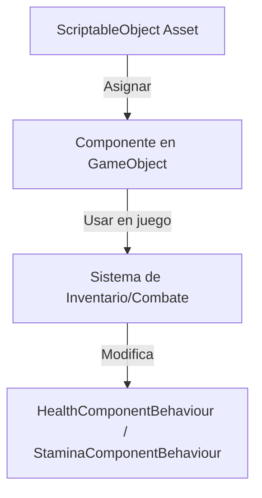

# Manual de Uso de ScriptableObjects Específicos

> **¡Bienvenido!** Este manual está pensado para quienes nunca han usado ScriptableObjects en Unity. Aquí aprenderás, paso a paso, cómo crearlos, asignarlos y usarlos correctamente en este proyecto.

> **IMPORTANTE:** Todos los ScriptableObjects de armas y objetos de curación interactúan exclusivamente con los componentes `HealthComponentBehaviour` y `StaminaComponentBehaviour` para modificar vida y stamina en el jugador o enemigos. Asegúrate de que estos behaviours estén presentes en los GameObjects correspondientes. Nunca accedas directamente a `HealthComponent` o `StaminaComponent` desde un ScriptableObject o cualquier otro sistema.
---

## Glosario Básico
- **Script:** Archivo de código (C#) que define lógica o datos.

---

## Mini-diagrama visual de flujo de ScriptableObjects



---

## Tabla de dependencias y asignaciones

| ScriptableObject      | Debe estar asignado en...                | Depende de...                        |
|----------------------|------------------------------------------|--------------------------------------|
| WeaponItem           | PlayerInventory, ItemDatabase            | WeaponHitbox prefab, HealthComponentBehaviour |
| HealingItem          | PlayerInventory, ItemDatabase            | HealthComponentBehaviour             |
| MysteryItem          | PlayerInventory, ItemDatabase            | IUsableItem, UI                      |
| CombatTransferData   | CombatSceneLoader, CombatSceneInitializer| Prefabs, datos temporales            |

---

## Tabla ampliada de errores frecuentes y soluciones

| Error / Síntoma                        | Causa probable                                      | Solución rápida                                      |
|----------------------------------------|-----------------------------------------------------|------------------------------------------------------|
| No puedes arrastrar el asset           | Campo en Inspector de tipo incorrecto               | Revisa el tipo del campo y el `[CreateAssetMenu]`    |
| No aparece opción de crear asset       | Falta `[CreateAssetMenu]` en el script              | Agrega `[CreateAssetMenu]` al ScriptableObject       |
| Asset no aparece en el juego           | No está asignado o campos incompletos               | Asigna el asset y completa todos los campos          |
| NullReferenceException                 | Asset no asignado o campo vacío                     | Asigna el asset en el Inspector                      |
| Arma no hace daño o no colisiona       | Prefab de hitbox incorrecto o sin WeaponHitbox      | Asigna prefab correcto y revisa el colisionador      |
| Ítem no se puede usar                  | No implementa IUsableItem o no está en ItemDatabase | Implementa interfaz y registra en ItemDatabase       |
| No transfiere datos entre escenas      | ScriptableObject no asignado                        | Asigna el asset en los componentes de transferencia  |
| Cambios en asset no se reflejan        | Asset duplicado o no se guarda                      | Usa un solo asset y guarda los cambios               |
| Inspector no muestra campos            | ScriptableObject mal serializado                    | Marca campos como [SerializeField]                   |

---

## Preguntas frecuentes (FAQ)

**¿Puedo modificar la vida directamente desde un ScriptableObject?**
---

**¿Por qué no aparece mi ScriptableObject en el menú de creación?**


**¿Puedo compartir un mismo ScriptableObject entre varios objetos?**


**¿Qué hago si el asset no funciona como espero?**
## ¿Qué es un ScriptableObject?

**¿Dónde encuentro más ayuda?**


---

## Referencias cruzadas

- [Manual de Asignaciones](MANUAL_DE_ASIGNACIONES.md): Guía paso a paso para asignar scripts y assets en escenas.
- [Documentación General](DOCUMENTACION.md): Referencia de clases, métodos y glosario del proyecto.

---
Un ScriptableObject es un archivo de datos que puedes crear y editar desde el editor de Unity. Sirve para definir las propiedades de armas, ítems, datos de combate, etc., y se puede reutilizar en muchos objetos sin duplicar información.

## ¿Cómo se crea un ScriptableObject?

1. Abre Unity y ve al panel `Project`.
2. Haz clic derecho en la carpeta donde quieras crear el asset (por ejemplo, `Assets/ScriptableObjects/Weapons/`).
3. Selecciona la opción correspondiente (por ejemplo, `Crear > Inventory > WeaponItem`).
4. Nombra el asset (ejemplo: `EspadaBasica`).
5. Haz clic en el asset creado y verás sus campos editables en el Inspector.

> **Visual:**
> 

---


## ¿Cómo asignar un ScriptableObject?

1. Selecciona el GameObject (por ejemplo, el jugador) en la jerarquía de la escena.
2. Busca el componente que tiene un campo para ScriptableObject (por ejemplo, `PlayerInventory`).
3. Arrastra el asset desde el panel `Project` al campo correspondiente en el Inspector.
4. ¡Listo! El ScriptableObject está asignado y listo para usarse en el juego.

> **Consejo:** Si no puedes arrastrar el asset, revisa que el campo sea del tipo correcto y que el script tenga `[CreateAssetMenu]`.

---


## ¿Cómo probar que funciona?

- Si es un arma, inicia el juego y verifica que el jugador pueda equiparla y atacar. El hitbox del arma se instanciará automáticamente y solo se activará durante el ataque.
- Si es una poción, úsala y observa si la vida del jugador aumenta.
- Si es un ítem misterioso, úsalo y revisa si revela su tipo o efecto.

> **¿No funciona?** Consulta la sección de errores frecuentes al final de este manual.

---


## Tabla rápida: ¿Qué ScriptableObject usar?

| Caso de uso         | ScriptableObject      | Dónde se asigna                        |
|---------------------|----------------------|----------------------------------------|
| Arma               | WeaponItem           | PlayerInventory, ItemDatabase          |
| Ítem de curación    | HealingItem          | PlayerInventory, ItemDatabase          |
| Ítem misterioso     | MysteryItem          | PlayerInventory, ItemDatabase          |
| Transferencia combate | CombatTransferData | CombatSceneLoader, CombatSceneInitializer |

## Errores frecuentes y cómo evitarlos

- **No puedes arrastrar el asset:** Asegúrate de que el campo en el Inspector sea del tipo correcto (por ejemplo, `WeaponItem`).
- **No aparece la opción de crear el asset:** El script debe tener `[CreateAssetMenu]`.
- **El asset no aparece en el juego:** Verifica que esté asignado en el Inspector y que todos los campos estén completos.
- **NullReferenceException:** El asset no está asignado o el campo está vacío.
- **El arma no hace daño o no colisiona:** Asegúrate de que el prefab de hitbox asignado en el `WeaponItem` tenga un componente `WeaponHitbox` y un colisionador configurado como `Trigger`.
- **El ítem no se puede usar:** Verifica que implemente la interfaz `IUsableItem` y esté registrado en el `ItemDatabase`.
- **No se transfiere información entre escenas:** Asegúrate de que el ScriptableObject esté asignado en los componentes de transferencia de datos.

---

# Manual Específico de ScriptableObjects

Este manual explica cómo crear, asignar y usar cada ScriptableObject de este proyecto, con ejemplos, funciones y resolución de errores frecuentes. Ideal para principiantes en Unity.

---

## 1. WeaponItem
- **¿Qué es?** Define los datos base de un arma (daño, velocidad, durabilidad, curvas de desgaste y maestría, y prefab de hitbox).
- **Cómo crearlo:**
  - Haz clic derecho en la carpeta deseada y selecciona `Crear > Inventory > WeaponItem`.
  - Asigna el prefab de hitbox en el campo `Weapon Hitbox Prefab` (debe tener el componente `WeaponHitbox`).
  - Completa los campos de daño, velocidad, durabilidad, etc.
- **Cómo usarlo:**
  - El arma se equipa desde el inventario y su hitbox se instancia automáticamente.
  - El hitbox solo se activa durante el ataque (controlado por el sistema de animación o el `AttackComponent`).
  - El daño se aplica siempre a través de `HealthComponentBehaviour` en el objetivo.
- **Ejemplo de flujo:**
  1. El jugador equipa el arma desde el inventario.
  2. Al atacar, el sistema activa el hitbox del arma.
  3. Si el hitbox colisiona con un enemigo, se llama a `ApplyDamage` del `WeaponItem`, que modifica la vida usando el wrapper.
- **Consejo:** No es necesario añadir scripts de arma manualmente a GameObjects. Todo se gestiona desde el ScriptableObject y el sistema de inventario/equipamiento.

## Campos públicos y `[SerializeField]` recomendados en `WeaponItem`

- `string id` : Identificador único del arma.
- `string displayName` : Nombre visible en UI.
- `int baseDamage` : Daño base por golpe.
- `float attackSpeed` : Velocidad de ataque (ataques por segundo).
- `float maxDurability` : Durabilidad máxima.
- `AnimationCurve durabilityCurve` : Curva que define desgaste por golpe.
- `AnimationCurve masteryCurve` : Curva de progresión de maestría.
- `int maxMasteryHits` : Número máximo de golpes para maestría completa.
- `GameObject weaponHitboxPrefab` : Prefab del hitbox (debe contener `WeaponHitbox`).

Ejemplo de configuración en el Inspector:

- `id` = "espada_basica"
- `displayName` = "Espada Básica"
- `baseDamage` = 20
- `attackSpeed` = 1.0
- `maxDurability` = 100
- `weaponHitboxPrefab` = (arrastrar prefab `Prefabs/Weapons/Hitbox_Espada`)

Checklist de pruebas:

- Verificar que el `weaponHitboxPrefab` contiene `WeaponHitbox` y un collider marcado como `IsTrigger` si así lo requiere el sistema.
- Equipar el arma en `PlayerEquipmentController` y realizar ataques; comprobar reducción de durabilidad y aumento de maestría.
- Comprobar que al romperse la durabilidad se dispara el evento correspondiente y el arma se elimina del slot.

---

## 2. HealingItem
- **¿Qué es?** Ítem de curación que puede usarse desde el inventario.
- **Cómo crearlo:**
  1. Clic derecho en `Assets/ScriptableObjects/Items/`.
  2. Crear > Inventory > HealingItem.
  3. Nombra el asset (ej: `PocionPequena`).
- **Dónde asignarlo:**
  - En `initialItems` de `PlayerInventory`.
  - En `ItemDatabase`.
- **Función:** Al usarlo, ejecuta `Use` y cura al jugador a través de `HealthComponentBehaviour`.
- **Errores frecuentes:**
  - No cura: asset no asignado o método `Use` no llamado.
  - No aparece en inventario: no fue agregado a la lista o no fue recogido.

---

## 3. MysteryItem
- **¿Qué es?** Ítem misterioso, su tipo real se revela al usarlo.
- **Cómo crearlo:**
  1. Clic derecho en `Assets/ScriptableObjects/Items/`.
  2. Crear > Inventory > MysteryItem.
  3. Nombra el asset (ej: `CajaSorpresa`).
- **Dónde asignarlo:**
  - En inventario inicial o como recompensa.
  - En `ItemDatabase`.
- **Función:** Se muestra como misterioso, al usarlo puede revelar su tipo o ejecutar un efecto.
- **Errores frecuentes:**
  - No revela su tipo: método de uso no implementado o UI no actualizada.
  - No se puede usar: no implementa `IUsableItem`.

---

## 4. CombatTransferData
- **¿Qué es?** ScriptableObject para transferir datos temporales entre escenas de combate.
- **Cómo crearlo:**
  1. Clic derecho en `Assets/ScriptableObjects/`.
  2. Crear > Combat > CombatTransferData.
  3. Nombra el asset (ej: `CombatTransferData`).
- **Dónde asignarlo:**
  - En `CombatSceneLoader` y `CombatSceneInitializer`.
- **Función:** Permite transferir referencias de prefabs y datos entre escenas.
- **Errores frecuentes:**
  - No transfiere datos: asset no asignado.

## HealingItem - campos recomendados

- `string id`
- `string displayName`
- `int healAmount` : Cantidad de vida que regenera el ítem.
- `float cooldown` : Tiempo entre usos (si aplica).

Ejemplo Inspector:

- `id` = "pocion_pequena"
- `displayName` = "Poción Pequeña"
- `healAmount` = 25

Checklist de pruebas:

- Añadir el `HealingItem` a `PlayerInventory.initialItems` y en runtime usarlo: comprobar incremento de vida y que el UI se actualiza.
- Si el `HealingItem` implementa `IUsableItem`, verificar que el `ItemDatabase` lo devuelve correctamente por `GetItem(id)`.

## Good-to-know: Validaciones comunes en ScriptableObjects

- Añadir validaciones con `OnValidate()` en los ScriptableObjects para comprobar que referencias obligatorias no estén null y que valores numéricos estén en rangos válidos.

Ejemplo (código recomendado dentro de `WeaponItem`):

```csharp
void OnValidate() {
    if (string.IsNullOrEmpty(id)) id = name.ToLower().Replace(" ", "_");
    if (weaponHitboxPrefab == null) Debug.LogWarning("WeaponItem sin hitbox: " + name);
}
```

---


## Buenas prácticas para ScriptableObjects

- Siempre interactúa con la vida y stamina a través de los wrappers `HealthComponentBehaviour` y `StaminaComponentBehaviour`.
- No accedas ni modifiques directamente `HealthComponent` o `StaminaComponent` desde ningún ScriptableObject.
- Si necesitas modificar la vida o stamina de un GameObject, primero obtén el wrapper correspondiente y luego accede a la propiedad pública.
- Documenta cada ScriptableObject con comentarios en el código y en el Inspector para que otros desarrolladores sepan cómo usarlo.
- Usa nombres descriptivos para los assets (ejemplo: `EspadaBasica`, `PocionPequena`).
