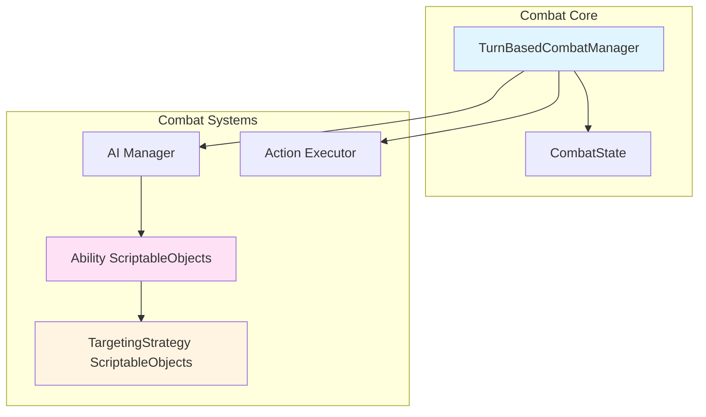
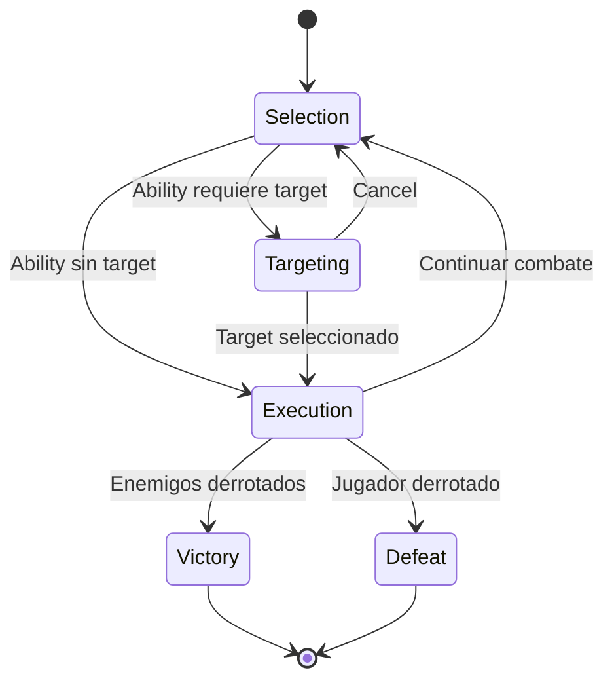

# ⚔️ Combat System - Documentación Detallada

Sistema de combate por turnos del proyecto Santa.

---

## 📋 Tabla de Contenidos

- [Visión General](#visión-general)
- [Arquitectura](#arquitectura)
- [Flujo de Combate](#flujo-de-combate)
- [Combat Phases](#combat-phases)
- [Sistema de Abilities](#sistema-de-abilities)
- [Sistema de Targeting](#sistema-de-targeting)
- [TurnBasedCombatManager](#turnbasedcombatmanager)
- [Extensión del Sistema](#extensión-del-sistema)

---

## Visión General

El sistema de combate es turn-based con las siguientes características:

- **Phases**: Selection → Targeting → Execution → Victory/Defeat
- **Action Points** para limitar acciones por turno
- **Abilities basadas en ScriptableObjects** configurables en el Editor
- **Targeting flexible** con Strategy Pattern (Self, SingleEnemy, AllEnemies, RandomEnemies)
- **AI enemiga** que planifica acciones basándose en la acción del jugador
- **Combat Log** para feedback visual

---

## Arquitectura

### Componentes Principales



### Ubicación de Scripts

```
Assets/Scripts/
├── Domain/Combat/                    
│   ├── Data/
│   │   └── Ability.cs               # Clase base ScriptableObject
│   ├── Abilities/                   # Implementaciones concretas
│   │   ├── DamageAbility.cs
│   │   └── HealAbility.cs
│   ├── Targeting/                   # Targeting strategies
│   │   ├── TargetingStrategy.cs    # Base class
│   │   ├── SingleEnemyTargeting.cs
│   │   ├── AllEnemiesTargeting.cs
│   │   ├── SelfTargeting.cs
│   │   └── RandomEnemiesTargeting.cs
│   └── CombatState.cs              # Estado del combate
│
└── Infrastructure/Combat/           
    ├── TurnBasedCombatManager.cs   # Manager principal
    ├── CombatStateManager.cs       # Gestión de estado
    ├── AIManager.cs                # IA de enemigos
    └── ActionExecutor.cs           # Ejecución de acciones
```

---

## Flujo de Combate

### Diagrama de Phases



### Enum CombatPhase

```csharp
public enum CombatPhase
{
    Selection,   // Jugador selecciona ability
    Targeting,   // Jugador selecciona objetivo (si se requiere)
    Execution,   // Se ejecutan acciones (jugador + enemigos)
    Victory,     // Victoria
    Defeat       // Derrota
}
```

---

## Combat Phases

### Selection Phase

**Estado**: `CombatPhase.Selection`

El jugador puede:
- Seleccionar una ability de sus botones de acción
- Ver sus Action Points disponibles
- Ver el estado de enemigos

```csharp
// En TurnBasedCombatManager
private void StartNewTurn()
{
    CurrentPhase = CombatPhase.Selection;
    OnPhaseChanged?.Invoke(CurrentPhase);
    _combatState.PendingActions.Clear();
    OnPlayerTurnStarted?.Invoke();
}
```

### Targeting Phase

**Estado**: `CombatPhase.Targeting`

**Solo se activa si**: La ability tiene `TargetingStyle.SingleEnemy` y no se proporcionó un target.

Cuando el jugador selecciona una ability que requiere target:
1. El manager cambia a `Targeting` phase
2. Se activan los colliders de los enemigos (`EnemyTarget`)
3. El jugador hace click en un enemigo
4. Se procesa la acción con el target seleccionado

```csharp
// Ability requiere target
if (ability.Targeting != null && ability.Targeting.Style == TargetingStyle.SingleEnemy && primaryTarget == null)
{
    _abilityPendingTarget = ability;
    CurrentPhase = CombatPhase.Targeting;
    SetEnemyTargetsActive(true); // Enable targeting colliders
    OnPhaseChanged?.Invoke(CurrentPhase);
    return;
}
```

**Cancelar targeting:**
```csharp
public void CancelTargeting()
{
    _abilityPendingTarget = null;
    SetEnemyTargetsActive(false);
    CurrentPhase = CombatPhase.Selection;
    OnPhaseChanged?.Invoke(CurrentPhase);
}
```

### Execution Phase

**Estado**: `CombatPhase.Execution`

Se ejecutan **todas las acciones** planificadas:
1. Jugador envía su acción
2. AI planifica acciones de enemigos
3. Acciones se ordenan por `ActionSpeed` (mayor = más rápido)
4. Acciones se ejecutan en orden
5. Se verifica victoria/derrota después de cada acción

```csharp
private async UniTaskVoid ExecuteTurnAsync()
{
    PrepareExecutionPhase(); // Ordenar acciones por speed
    
    foreach (var action in _sortedActions)
    {
        CombatResult result = await ProcessActionAsync(action);
        if (result != CombatResult.Ongoing)
        {
            HandleCombatEnd(result);
            return;
        }
    }
    
    StartNewTurn(); // Nueva ronda
}
```

---

## Sistema de Abilities

### Clase Base: Ability (ScriptableObject)

**Ubicación**: `Domain/Combat/Data/Ability.cs`

```csharp
public abstract class Ability : ScriptableObject
{
    [Header("Info")]
    [SerializeField] private string _abilityName;
    [SerializeField][TextArea] private string _description;
    
    [Header("Properties")]
    [SerializeField] private int _apCost = 1;
    [SerializeField] private TargetingStrategy _targeting;
    [SerializeField][Range(0f, 1f)] private float _targetPercentage = 1f;
    [SerializeField] private int _actionSpeed = 100;
    
    // Properties públicas
    public string AbilityName => _abilityName;
    public string Description => _description;
    public int ApCost => _apCost;
    public TargetingStrategy Targeting => _targeting;
    public float TargetPercentage => _targetPercentage;
    public int ActionSpeed => _actionSpeed;
    
    /// <summary>
    /// Executes the ability's logic on the given targets.
    /// </summary>
    public abstract void Execute(List<GameObject> targets, GameObject caster, 
        IUpgradeService upgradeService, IReadOnlyList<GameObject> allCombatants);
    
    /// <summary>
    /// Rolls for a critical hit based on upgrade service critical chance.
    /// </summary>
    protected bool RollCriticalHit(IUpgradeService upgradeService)
    {
        return upgradeService != null
            && upgradeService.CriticalHitChance > 0f
            && Random.value < upgradeService.CriticalHitChance;
    }
}
```

**Características clave:**
- ✅ Hereda de `ScriptableObject` (creado como asset en el editor)
- ✅ Usa `[SerializeField]` para campos editables en Inspector
- ✅ `Execute()` recibe lista de targets ya resuelta
- ✅ NO retorna valores, es `void`
- ✅ Helper `RollCriticalHit()` para critical hits

### Ejemplo Real: DamageAbility

**Ubicación**: `Domain/Combat/Abilities/DamageAbility.cs`

```csharp
[CreateAssetMenu(fileName = "New Damage Ability", menuName = "Santa/Abilities/Damage Ability")]
public class DamageAbility : Ability
{
    [Header("Damage Settings")]
    [Tooltip("Type of attack to determine which upgrade stat to use for damage.")]
    [SerializeField] private AbilityType abilityType = AbilityType.DirectAttack;
    
    private static ICombatLogService _combatLog;
    
    [Inject]
    public void Construct(ICombatLogService combatLogService)
    {
        _combatLog = combatLogService;
    }
    
    public override void Execute(List<GameObject> targets, GameObject caster, 
        IUpgradeService upgradeService, IReadOnlyList<GameObject> allCombatants)
    {
        if (targets == null || targets.Count == 0) return;
        
        // Obtener damage del UpgradeService según tipo de ability
        int damage = 10; // Fallback
        if (upgradeService != null)
        {
            damage = abilityType switch
            {
                AbilityType.DirectAttack => upgradeService.DirectAttackDamage,
                AbilityType.AreaAttack => upgradeService.AreaAttackDamage,
                _ => 10
            };
        }
        
        _combatLog?.LogMessage($"{caster.name} uses {AbilityName}!", CombatLogType.Info);
        
        // Aplicar damage a todos los targets
        for (int i = 0; i < targets.Count; i++)
        {
            GameObject target = targets[i];
            if (target == null) continue;
            
            if (target.TryGetComponent<HealthComponentBehaviour>(out var health))
            {
                // Roll critical hit per-target
                bool isCritical = RollCriticalHit(upgradeService);
                int finalDamage = isCritical ? damage * 2 : damage;
                
                health.AffectValue(-finalDamage);
                
                if (isCritical)
                {
                    _combatLog?.LogMessage($"CRITICAL HIT! {target.name} takes {finalDamage} damage!", 
                        CombatLogType.Critical);
                }
                else
                {
                    _combatLog?.LogMessage($"{target.name} takes {finalDamage} damage.", 
                        CombatLogType.Damage);
                }
            }
        }
        
        // Area Attack Splash Damage Logic
        if (abilityType == AbilityType.AreaAttack && targets.Count > 0 && allCombatants != null)
        {
            GameObject primaryTarget = targets[0];
            string targetTag = primaryTarget?.tag;
            
            // Find other targets with same tag (enemies if primary is enemy)
            List<GameObject> splashTargets = new List<GameObject>();
            for (int i = 0; i < allCombatants.Count; i++)
            {
                var combatant = allCombatants[i];
                if (combatant != null && combatant.activeInHierarchy
                    && combatant.CompareTag(targetTag)
                    && combatant != primaryTarget && combatant != caster)
                {
                    if (combatant.TryGetComponent<HealthComponentBehaviour>(out var health) 
                        && health.CurrentValue > 0)
                    {
                        splashTargets.Add(combatant);
                    }
                }
            }
            
            // Splash damage to one random target (50% of base damage)
            if (splashTargets.Count > 0)
            {
                int randomIndex = Random.Range(0, splashTargets.Count);
                GameObject splashTarget = splashTargets[randomIndex];
                
                if (splashTarget.TryGetComponent<HealthComponentBehaviour>(out var splashHealth))
                {
                    int splashDamage = damage / 2;
                    splashHealth.AffectValue(-splashDamage);
                    _combatLog?.LogMessage($"[SPLASH] {splashTarget.name} takes {splashDamage} area damage!", 
                        CombatLogType.Damage);
                }
            }
        }
    }
}
```

**Características:**
- ✅ `[CreateAssetMenu]` para crear assets en el editor
- ✅ Damage viene del `UpgradeService`, NO hardcodeado
- ✅ Soporte para **Critical Hits**
- ✅ **Splash damage** para AreaAttack
- ✅ Usa `[Inject]` para DI del `ICombatLogService`
- ✅ Usa `HealthComponentBehaviour.AffectValue()` para aplicar damage

### Ejemplo: HealAbility

```csharp
[CreateAssetMenu(fileName = "New Heal Ability", menuName = "Santa/Abilities/Heal Ability")]
public class HealAbility : Ability
{
    [SerializeField] private int baseHealAmount = 20;
    
    public override void Execute(List<GameObject> targets, GameObject caster, 
        IUpgradeService upgradeService, IReadOnlyList<GameObject> allCombatants)
    {
        if (targets == null || targets.Count == 0) return;
        
        for (int i = 0; i < targets.Count; i++)
        {
            GameObject target = targets[i];
            if (target == null) continue;
            
            if (target.TryGetComponent<HealthComponentBehaviour>(out var health))
            {
                int healAmount = baseHealAmount;
                
                // Can't heal above max
                int actualHeal = Mathf.Min(healAmount, health.MaxValue - health.CurrentValue);
                
                health.AffectValue(actualHeal);
                
                // Log to combat log
                _combatLog?.LogMessage($"{target.name} healed for {actualHeal} HP!", 
                    CombatLogType.Heal);
            }
        }
    }
}
```

---

## Sistema de Targeting

### Clase Base: TargetingStrategy (ScriptableObject)

**Ubicación**: `Domain/Combat/Targeting/TargetingStrategy.cs`

```csharp
public enum TargetingStyle
{
    Self,
    SingleEnemy,
    SingleAlly,
    AllEnemies,
    AllAllies
}

public abstract class TargetingStrategy : ScriptableObject
{
    public abstract TargetingStyle Style { get; }
    
    public abstract void ResolveTargets(GameObject caster, GameObject primaryTarget, 
        IReadOnlyList<GameObject> allCombatants, List<GameObject> results, Ability ability);
}
```

**Características:**
- ✅ Es un `ScriptableObject`, NO una interfaz
- ✅ `ResolveTargets()` **popula** la lista `results`, NO retorna nada
- ✅ `Style` enum para que el UI sepa si requiere selección manual

### Implementaciones

#### SingleEnemyTargeting

```csharp
[CreateAssetMenu(fileName = "SingleEnemyTargeting", menuName = "Santa/Abilities/Targeting/Single Enemy")]
public class SingleEnemyTargeting : TargetingStrategy
{
    public override TargetingStyle Style => TargetingStyle.SingleEnemy;
    
    public override void ResolveTargets(GameObject caster, GameObject primaryTarget, 
        IReadOnlyList<GameObject> allCombatants, List<GameObject> results, Ability ability)
    {
        if (primaryTarget != null && primaryTarget.activeInHierarchy)
        {
            results.Add(primaryTarget);
        }
    }
}
```

#### AllEnemiesTargeting

```csharp
[CreateAssetMenu(fileName = "AllEnemiesTargeting", menuName = "Santa/Abilities/Targeting/All Enemies")]
public class AllEnemiesTargeting : TargetingStrategy
{
    public override TargetingStyle Style => TargetingStyle.AllEnemies;
    
    public override void ResolveTargets(GameObject caster, GameObject primaryTarget, 
        IReadOnlyList<GameObject> allCombatants, List<GameObject> results, Ability ability)
    {
        string casterTag = caster.tag;
        
        for (int i = 0; i < allCombatants.Count; i++)
        {
            var combatant = allCombatants[i];
            if (combatant != null && combatant.activeInHierarchy
                && !combatant.CompareTag(casterTag)) // Different team
            {
                if (combatant.TryGetComponent<HealthComponentBehaviour>(out var health) 
                    && health.CurrentValue > 0)
                {
                    results.Add(combatant);
                }
            }
        }
    }
}
```

#### SelfTargeting

```csharp
[CreateAssetMenu(fileName = "SelfTargeting", menuName = "Santa/Abilities/Targeting/Self")]
public class SelfTargeting : TargetingStrategy
{
    public override TargetingStyle Style => TargetingStyle.Self;
    
    public override void ResolveTargets(GameObject caster, GameObject primaryTarget, 
        IReadOnlyList<GameObject> allCombatants, List<GameObject> results, Ability ability)
    {
        if (caster != null && caster.activeInHierarchy)
        {
            results.Add(caster);
        }
    }
}
```

---

## TurnBasedCombatManager

### API Pública

```csharp
public class TurnBasedCombatManager : MonoBehaviour, ICombatService
{
    // Events
    public event Action<CombatPhase> OnPhaseChanged;
    public event Action OnPlayerTurnStarted;
    public event Action OnPlayerTurnEnded;
    
    // Properties
    public CombatPhase CurrentPhase { get; private set; }
    public IReadOnlyList<GameObject> AllCombatants => _combatState.AllCombatants;
    public IReadOnlyList<GameObject> Enemies => _combatState.Enemies;
    public GameObject Player => _combatState.Player;
    
    // Public Methods
    public void StartCombat(List<GameObject> participants);
    public void SubmitPlayerAction(Ability ability, GameObject primaryTarget = null);
    public void CancelTargeting();
}
```

**Importante:**
- ✅ `StartCombat` NO es async, es sync
- ✅ Recibe `List<GameObject> participants`, NO un encounter key
- ✅ NO hay método `ExecuteAbility`, hay `SubmitPlayerAction`
- ✅ `EndCombat` es **privado**

### Uso

```csharp
// En UI o sistema que inicia combate
var participants = new List<GameObject> { player, enemy1, enemy2 };
_combatManager.StartCombat(participants);

// Player selecciona ability
_combatManager.SubmitPlayerAction(selectedAbility, selectedTarget);

// Cancelar selección de target
_combatManager.CancelTargeting();
```

---

## Extensión del Sistema

### Crear Nueva Ability

1. **Crear ScriptableObject asset:**

```csharp
[CreateAssetMenu(fileName = "New Poison Ability", menuName = "Santa/Abilities/Poison Ability")]
public class PoisonAbility : Ability
{
    [SerializeField] private int poisonDamage = 3;
    [SerializeField] private int poisonDuration = 3;
    
    public override void Execute(List<GameObject> targets, GameObject caster, 
        IUpgradeService upgradeService, IReadOnlyList<GameObject> allCombatants)
    {
        for (int i = 0; i < targets.Count; i++)
        {
            GameObject target = targets[i];
            if (target == null) continue;
            
            // Immediate damage
            if (target.TryGetComponent<HealthComponentBehaviour>(out var health))
            {
                health.AffectValue(-5);
            }
            
            // Apply poison effect (would need StatusEffectSystem)
// ApplyPoisonEffect(target, poisonDamage, poisonDuration);
        }
    }
}
```

2. **Crear asset en Unity:**
   - Right-click en Project
   - `Create → Santa → Abilities → Poison Ability`
   - Configurar propiedades en Inspector
   - Asignar `TargetingStrategy` (ej: SingleEnemyTargeting)

3. **Asignar a personaje:**
   - Agregar ability al `AbilityHolder` del personaje

### Crear Nuevo Targeting Pattern

```csharp
[CreateAssetMenu(fileName = "ClosestEnemyTargeting", menuName = "Santa/Abilities/Targeting/Closest Enemy")]
public class ClosestEnemyTargeting : TargetingStrategy
{
    public override TargetingStyle Style => TargetingStyle.SingleEnemy;
    
    public override void ResolveTargets(GameObject caster, GameObject primaryTarget, 
        IReadOnlyList<GameObject> allCombatants, List<GameObject> results, Ability ability)
    {
        string casterTag = caster.tag;
        GameObject closestEnemy = null;
        float closestDistance = float.MaxValue;
        
        for (int i = 0; i < allCombatants.Count; i++)
        {
            var combatant = allCombatants[i];
            if (combatant != null && combatant.activeInHierarchy
                && !combatant.CompareTag(casterTag))
            {
                float distance = Vector3.Distance(caster.transform.position, combatant.transform.position);
                if (distance < closestDistance)
                {
                    closestDistance = distance;
                    closestEnemy = combatant;
                }
            }
        }
        
        if (closestEnemy != null)
        {
            results.Add(closestEnemy);
        }
    }
}
```

---

**Última actualización**: Enero 2026

Ver también:
- [SYSTEMS.md](SYSTEMS.md) - Overview general de sistemas
- [ARCHITECTURE.md](ARCHITECTURE.md) - Arquitectura del proyecto
