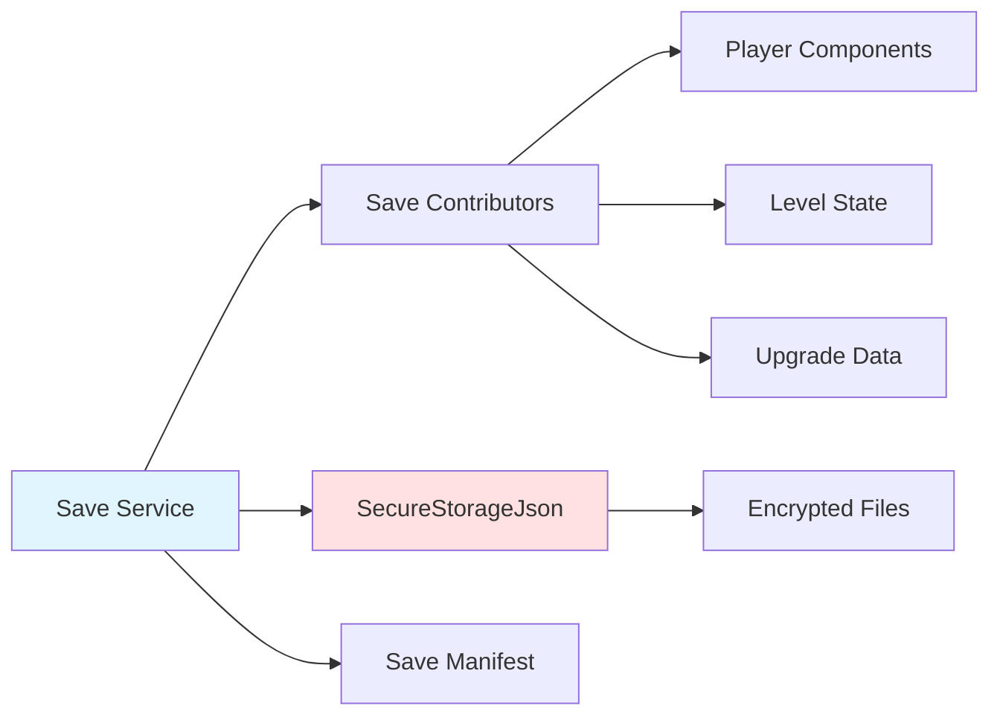

# 💾 Save System - Documentación

Sistema de guardado y persistencia del proyecto Santa.

---

## Visión General

El Save System usa un patrón **Contributor** donde diferentes componentes pueden contribuir sus datos al save de forma modular y desacoplada.

### Características

- ✅ **Modular** - Componentes implementan `ISaveContributor`
- ✅ **Seguro** - Usa `SecureStorageJson` para encriptación
- ✅ **Simple** - API sync, sin complejidad async innecesaria
- ✅ **Backup automático** - Sistema de backups con límite
- ✅ **Single slot** - Un único save game por simplicidad

---

## Arquitectura



---

## Componentes Principales

### SaveService

**Ubicación**: `Infrastructure/Save/SaveService.cs`

```csharp
public class SaveService : MonoBehaviour, ISaveService
{
    private ISaveContributorRegistry _registry;
    private ISecureStorageService _secureStorage;
    private IEventBus _eventBus;
    
    [Inject]
    public void Construct(ISaveContributorRegistry registry, 
        ISecureStorageService secureStorage, IEventBus eventBus)
    {
        _registry = registry;
        _secureStorage = secureStorage;
        _eventBus = eventBus;
    }
    
    // Sync methods - NO async
    public bool Save();
    public bool TryLoad();
    public void Delete();
    public bool TryGetLastSaveTimeUtc(out DateTime timestamp);
}
```

**Características clave:**
- ✅ Métodos son **sync**, NO async
- ✅ NO recibe `slotId`, usa un único slot automático
- ✅ Retorna `bool` indicando éxito/fracaso
- ✅ `TryLoad()` retorna `bool`, NO `UniTask<bool>`

### API Pública

#### Guardar Juego

```csharp
public bool Save()
{
    if (!CanSaveNow())
    {
        GameLog.LogWarning("SaveService: Cannot save in combat.");
        return false;
    }
    
    // Create backup before saving
    CreateBackup();
    
    var saveData = new SaveData
    {
        SaveVersion = SAVE_VERSION,
        TimestampUtc = DateTime.UtcNow.ToString("o")
    };
    
    // Write data from all contributors
    WriteContributors(ref saveData);
    
    // Save to secure storage
    _secureStorage.Save(SAVE_KEY, saveData);
    
    // Update manifest
    var manifest = LoadManifest();
    manifest.LastSaveUtc = saveData.TimestampUtc;
    SaveManifest(manifest);
    
    _eventBus?.Publish(new GameSavedEvent());
    return true;
}
```

#### Cargar Juego

```csharp
public bool TryLoad()
{
    if (!_secureStorage.TryLoad(SAVE_KEY, out SaveData saveData))
    {
        GameLog.LogWarning("SaveService: No save data found.");
        return false;
    }
    
    // Validate version
    if (saveData.SaveVersion != SAVE_VERSION)
    {
        GameLog.LogWarning($"SaveService: Save version mismatch. Expected {SAVE_VERSION}, got {saveData.SaveVersion}");
        
        // Try to load from backup
        if (!TryLoadFromBackup())
        {
            return false;
        }
    }
    
    // Read data to all contributors
    ReadContributors(in saveData);
    
    _eventBus?.Publish(new GameLoadedEvent());
    return true;
}
```

#### Eliminar Save

```csharp
public void Delete()
{
    _secureStorage.Delete(SAVE_KEY);
    DeleteAllBackups();
    
    var manifest = new SaveManifest();
    SaveManifest(manifest);
}
```

---

## ISaveContributor Interface

**Ubicación**: `Infrastructure/Save/ISaveContributor.cs`

```csharp
public interface ISaveContributor
{
    void WriteTo(ref SaveData data);
    void ReadFrom(in SaveData data);
}
```

**Características:**
- ✅ `WriteTo()` recibe `ref SaveData` para modificarlo
- ✅ `ReadFrom()` recibe `in SaveData` (read-only)
- ✅ NO hay `GetContributorId()` o `CaptureState()`

---

## Implementar Save Contributor

### Paso 1: Datos Serializables

```csharp
[Serializable]
public struct SaveData
{
    public string SaveVersion;
    public string TimestampUtc;
    
    // Player data
    public Vector3 PlayerPosition;
    public int PlayerHealth;
    public int PlayerMaxHealth;
    
    // Upgrade data
    public int UpgradePoints;
    public int MaxActionPoints;
    public int MaxHealth;
    public int DirectAttackDamage;
    
    // Level data
    public string CurrentSceneName;
    public List<string> DefeatedEnemyIds;
    public List<string> CollectedItemIds;
}
```

### Paso 2: Implementar ISaveContributor

Ejemplo con componente de jugador:

```csharp
public class PlayerSaveContributor : MonoBehaviour, ISaveContributor
{
    [SerializeField] private Transform _playerTransform;
    [SerializeField] private HealthComponentBehaviour _health;
    
    public void WriteTo(ref SaveData data)
    {
        if (_playerTransform != null)
        {
            data.PlayerPosition = _playerTransform.position;
        }
        
        if (_health != null)
        {
            data.PlayerHealth = _health.CurrentValue;
            data.PlayerMaxHealth = _health.MaxValue;
        }
    }
    
    public void ReadFrom(in SaveData data)
    {
        if (_playerTransform != null)
        {
            _playerTransform.position = data.PlayerPosition;
        }
        
        if (_health != null)
        {
            _health.SetMaxValue(data.PlayerMaxHealth);
            _health.SetValue(data.PlayerHealth);
        }
    }
}
```

**Nota**: Los contributors NO se registran automáticamente. Se invocan directamente desde `SaveService.WriteContributors()` y `SaveService.ReadContributors()`.

### Paso 3: Agregar al SaveService

```csharp
// En SaveService.WriteContributors()
private void WriteContributors(ref SaveData data)
{
    // Find and write from player contributor
    var playerContributor = FindFirstObjectByType<PlayerSaveContributor>();
    if (playerContributor != null)
    {
        playerContributor.WriteTo(ref data);
    }
    
    // Find and write from upgrade manager
    var upgradeManager = FindFirstObjectByType<UpgradeManager>();
    if (upgradeManager != null)
    {
        upgradeManager.WriteTo(ref data);
    }
    
    // Add more contributors as needed...
}

// En SaveService.ReadContributors()
private void ReadContributors(in SaveData data)
{
    var playerContributor = FindFirstObjectByType<PlayerSaveContributor>();
    if (playerContributor != null)
    {
        playerContributor.ReadFrom(in data);
    }
    
    var upgradeManager = FindFirstObjectByType<UpgradeManager>();
    if (upgradeManager != null)
    {
        upgradeManager.ReadFrom(in data);
    }
}
```

---

## SecureStorageService

**Ubicación**: `Infrastructure/Save/SecureStorageService.cs`

```csharp
public interface ISecureStorageService
{
    void Save<T>(string key, T data);
    bool TryLoad<T>(string key, out T data);
    void Delete(string key);
}

public class SecureStorageService : ISecureStorageService
{
    public void Save<T>(string key, T data)
    {
        SecureStorageJson.Set(key, data);
    }
    
    public bool TryLoad<T>(string key, out T data)
    {
        return SecureStorageJson.TryGet(key, out data);
    }
    
    public void Delete(string key)
    {
        SecureStorageJson.Delete(key);
    }
}
```

**Características:**
- ✅ Usa **genéricos** `<T>`, NO trabaja con strings
- ✅ Métodos son **sync**, NO async
- ✅ Delega a `SecureStorageJson` (helper estático)
- ✅ NO implementa encriptación directamente

### SecureStorageJson

El helper `SecureStorageJson` (parte del proyecto) maneja:
- Serialización a JSON
- Encriptación AES
- Escritura a disco en `Application.persistentDataPath`

```csharp
// Uso interno del SecureStorageService
SecureStorageJson.Set("game_save", saveData);
bool loaded = SecureStorageJson.TryGet("game_save", out SaveData data);
```

---

## Sistema de Backups

### Crear Backup

```csharp
private void CreateBackup()
{
    // Load current save
    if (!_secureStorage.TryLoad(SAVE_KEY, out SaveData currentData))
    {
        return; // No save to backup
    }
    
    // Save with timestamp key
    string backupKey = $"{BACKUP_PREFIX}{DateTime.UtcNow.Ticks}";
    _secureStorage.Save(backupKey, currentData);
    
    // Clean old backups (keep only MAX_BACKUPS)
    CleanOldBackups();
}
```

### Cargar desde Backup

```csharp
private bool TryLoadFromBackup()
{
    var backupKeys = GetBackupKeysSorted(); // Sorted by timestamp, newest first
    
    foreach (var key in backupKeys)
    {
        if (_secureStorage.TryLoad(key, out SaveData backupData))
        {
            // Write backup to main save
            _secureStorage.Save(SAVE_KEY, backupData);
            GameLog.Log($"SaveService: Loaded from backup: {key}");
            return true;
        }
    }
    
    return false;
}
```

---

## Uso del Save System

### Guardar desde UI

```csharp
public class SaveMenuController : MonoBehaviour
{
    [Inject] private ISaveService _saveService;
    
    public void OnSaveButtonClicked()
    {
        bool success = _saveService.Save();
        
        if (success)
        {
            ShowMessage("Game saved successfully!");
        }
        else
        {
            ShowError("Failed to save game. Try again later.");
        }
    }
}
```

### Cargar desde Main Menu

```csharp
public class MainMenuController : MonoBehaviour
{
    [Inject] private ISaveService _saveService;
    [Inject] private ILevelService _levelService;
    
    public void OnContinueButtonClicked()
    {
        bool success = _saveService.TryLoad();
        
        if (success)
        {
            // Load the saved scene
            _levelService.LoadLevel("Exploration_01");
        }
        else
        {
            ShowError("No save data found. Start a new game.");
        }
    }
}
```

### Verificar si Existe Save

```csharp
public void UpdateContinueButton()
{
    bool hasSave = _saveService.TryGetLastSaveTimeUtc(out DateTime timestamp);
    
    _continueButton.interactable = hasSave;
    
    if (hasSave)
    {
        _lastSaveText.text = $"Last played: {timestamp.ToLocalTime():g}";
    }
    else
    {
        _lastSaveText.text = "No save data";
    }
}
```

---

## Prevención de Save en Combate

```csharp
private bool CanSaveNow()
{
    // Don't save during combat
    if (TurnBasedCombatManager.CombatIsInitialized)
    {
        return false;
    }
    
    return true;
}
```

---

## Auto-Save (Opcional)

Ejemplo de sistema auto-save:

```csharp
public class AutoSaveManager : MonoBehaviour
{
    [Inject] private ISaveService _saveService;
    [Inject] private IEventBus _eventBus;
    
    [SerializeField] private float _autoSaveInterval = 300f; // 5 minutes
    private float _timeSinceLastSave;
    
    void OnEnable()
    {
        _eventBus.Subscribe<LevelCompletedEvent>(OnLevelCompleted);
    }
    
    void Update()
    {
        _timeSinceLastSave += Time.deltaTime;
        
        if (_timeSinceLastSave >= _autoSaveInterval)
        {
            AutoSave();
        }
    }
    
    private void AutoSave()
    {
        _timeSinceLastSave = 0f;
        
        if (_saveService.Save())
        {
            GameLog.Log("Auto-saved game");
        }
    }
    
    private void OnLevelCompleted(LevelCompletedEvent evt)
    {
        AutoSave(); // Save on level completion
    }
}
```

---

## Best Practices

### ✅ DO's

- **Guardar en momentos seguros** (fuera de combate, después de eventos importantes)
- **Validar datos** al cargar (null checks, range checks)
- **Usar SaveData struct** para mantener todo el save en un solo lugar
- **Crear backups** antes de sobrescribir el save principal
- **Usar `TryLoad()`** en lugar de asumir que el save existe

### ❌ DON'Ts

- No guardar referencias a `UnityEngine.Object` (solo datos primitivos/serializables)
- No guardar durante combate o transiciones
- No asumir que `TryLoad()` siempre tiene éxito
- No guardar datos gigantes (usa references a assets en lugar de duplicar)

---

## Troubleshooting

### Save no se carga

**Posibles causas**:
- Versión incompatible (cambió `SAVE_VERSION`)
- Datos corruptos
- No hay save en disco

**Solución**:
```csharp
if (!_saveService.TryLoad())
{
    // Try backup
    if (!_saveService.TryLoadFromBackup())
    {
        // Start new game
        StartNewGame();
    }
}
```

### Performance Issues

Si el save es lento:
- Reducir cantidad de datos guardados
- Usar `FindFirstObjectByType` solo una vez y cachear
- Evitar buscar contributors en cada frame

---

**Última actualización**: Enero 2026

Ver también:
- [SYSTEMS.md](SYSTEMS.md#2️⃣-save-system) - Save system overview
- [ARCHITECTURE.md](ARCHITECTURE.md) - Arquitectura general
