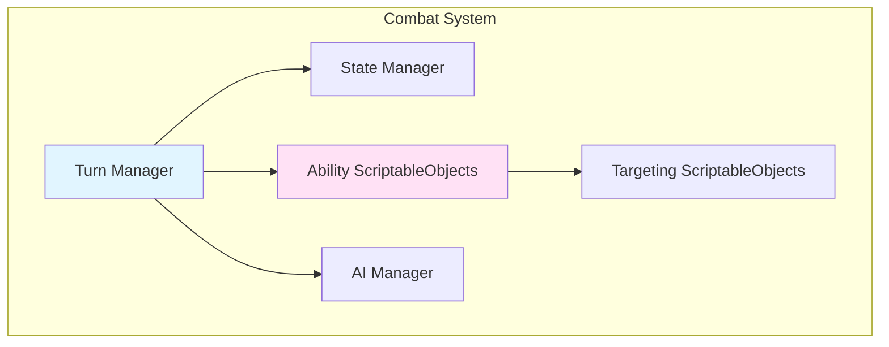
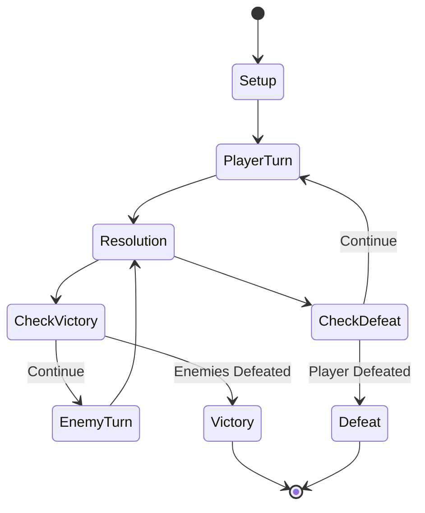
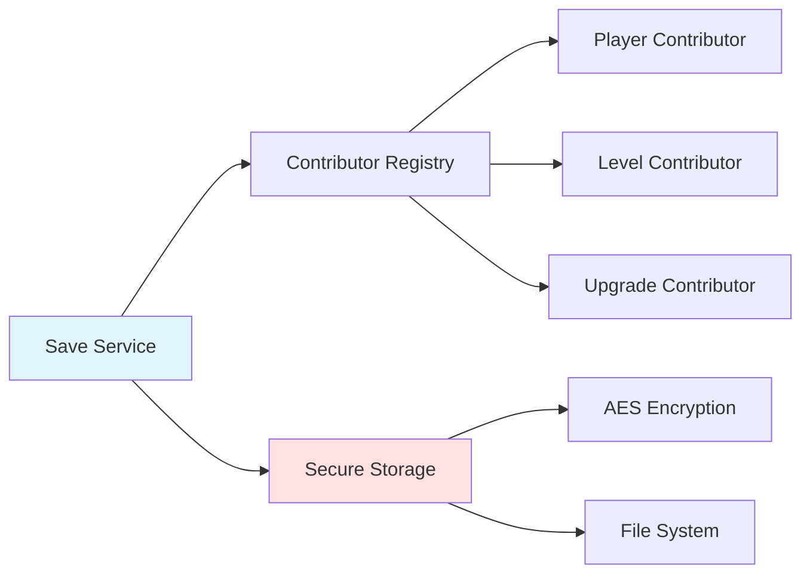
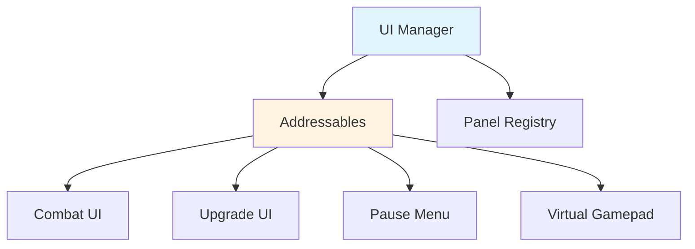
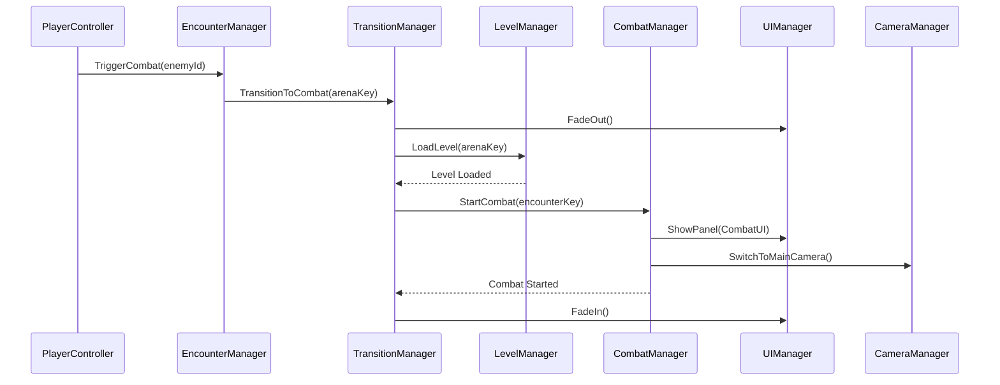
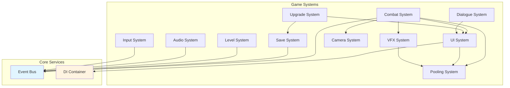

# 🎮 Sistemas del Proyecto Santa

Documentación detallada de todos los sistemas principales del juego.

---

## 📑 Índice de Sistemas

1. [Combat System](#1️⃣-combat-system)
2. [Save System](#2️⃣-save-system)
3. [UI System](#3️⃣-ui-system)
4. [Upgrade System](#4️⃣-upgrade-system)
5. [Level System](#5️⃣-level-system)
6. [Audio System](#6️⃣-audio-system)
7. [VFX System](#7️⃣-vfx-system)
8. [Camera System](#8️⃣-camera-system)
9. [Input System](#9️⃣-input-system)
10. [Pooling System](#🔟-pooling-system)
11. [Dialogue System](#1️⃣1️⃣-dialogue-system)

---

## 1️⃣ Combat System

El sistema de combate por turnos es el núcleo del gameplay.

### Arquitectura



### Componentes Principales

#### TurnBasedCombatManager
**Ubicación**: `Infrastructure/Combat/TurnBasedCombatManager.cs`

Gestiona el flujo general del combate.

```csharp
public class TurnBasedCombatManager : MonoBehaviour, ICombatService
{
    public void StartCombat(List<GameObject> participants);
    public void SubmitPlayerAction(Ability ability, GameObject primaryTarget = null);
    public void CancelTargeting();
}
```

**Responsabilidades**:
- Iniciar y finalizar combates
- Coordinar phases (Selection, Targeting, Execution)
- Gestionar victorias/derrotas

#### Ability System (ScriptableObjects)
**Ubicación**: `Domain/Combat/`

Sistema basado en ScriptableObjects para crear abilities como assets.

```csharp
public abstract class Ability : ScriptableObject
{
    public string AbilityName { get; }
    public int ApCost { get; }
    public TargetingStrategy Targeting { get; }
    public int ActionSpeed { get; }
    
    public abstract void Execute(List<GameObject> targets, GameObject caster, 
        IUpgradeService upgradeService, IReadOnlyList<GameObject> allCombatants);
}
```

Ver [COMBAT_SYSTEM.md](COMBAT_SYSTEM.md) para documentación completa.

#### CombatStateManager
**Ubicación**: `Infrastructure/Combat/CombatStateManager.cs`

Implementa State Pattern para phases del combate.

**Estados**:
- `Setup` - Inicialización
- `PlayerTurn` - Turno del jugador
- `EnemyTurn` - Turno de enemigos
- `Resolution` - Resolución de efectos
- `Victory` - Victoria
- `Defeat` - Derrota

```csharp
public async UniTask TransitionTo(CombatPhase newPhase)
{
    await _currentState?.OnExit();
    _currentState = CreateState(newPhase);
    await _currentState.OnEnter();
}
```

#### Ability System
**Ubicación**: `Domain/Combat/Abilities/`

Sistema extensible para habilidades.

```csharp
public abstract class Ability
{
    public abstract AbilityType Type { get; }
    public abstract int ActionPointCost { get; }
    
    public abstract bool CanExecute(AbilityContext context);
    public abstract AbilityResult Execute(AbilityContext context);
}

// Ejemplo de ability concreta
public class DamageAbility : Ability
{
    public override AbilityResult Execute(AbilityContext context)
    {
        int damage = CalculateDamage(context);
        context.Target.TakeDamage(damage);
        return AbilityResult.Success(damage);
    }
}
```

#### Targeting System
**Ubicación**: `Domain/Combat/Targeting/`

Gestiona la selección de objetivos.

**Patrones de targeting**:
- `SingleTarget` - Un enemigo
- `AllEnemies` - Todos los enemigos
- `Self` - El usuario
- `RandomEnemy` - Enemigo aleatorio

```csharp
public interface ITargetingPattern
{
    List<TargetId> SelectTargets(TargetingContext context);
    bool IsValidTarget(TargetId target, TargetingContext context);
}
```

### Flujo de Combate



### APIs Públicas

```csharp
// Iniciar combate desde exploración
ICombatService combat = Container.Resolve<ICombatService>();
await combat.StartCombat("ExplorationEnemy_01");

// Ejecutar ability
combat.ExecuteAbility("attack_basic", new TargetId("enemy_1"));

// Escuchar eventos
_eventBus.Subscribe<CombatStartedEvent>(OnCombatStarted);
_eventBus.Subscribe<TurnStartedEvent>(OnTurnStarted);
_eventBus.Subscribe<AbilityExecutedEvent>(OnAbilityExecuted);
```

### Extensión del Sistema

Para agregar una nueva ability:

1. Crear clase que extienda `Ability`
2. Implementar `Execute()` y `CanExecute()`
3. Registrar en el sistema de abilities
4. Crear UI button (opcional)

```csharp
public class HealAbility : Ability
{
    public override AbilityType Type => AbilityType.Heal;
    public override int ActionPointCost => 2;
    
    public override bool CanExecute(AbilityContext context)
    {
        return context.User.CurrentHealth < context.User.MaxHealth;
    }
    
    public override AbilityResult Execute(AbilityContext context)
    {
        int healAmount = context.User.MaxHealth / 4;
        context.User.Heal(healAmount);
        return AbilityResult.Success(healAmount);
    }
}
```

---

## 2️⃣ Save System

Sistema robusto de persistencia con encriptación.

### Arquitectura



### Componentes Principales

#### SaveService
**Ubicación**: `Infrastructure/Save/SaveService.cs`

```csharp
public class SaveService : MonoBehaviour, ISaveService
{
    public async UniTask<bool> SaveGame(string slotId);
    public async UniTask<bool> LoadGame(string slotId);
    public bool HasSaveData(string slotId);
    public void DeleteSave(string slotId);
}
```

#### SaveContributor Pattern

Permite que diferentes sistemas contribuyan al save de forma modular.

```csharp
public interface ISaveContributor
{
    string GetContributorId();
    object CaptureState();
    void RestoreState(object state);
}

// Ejemplo: Player Contributor
public class PlayerSaveContributor : MonoBehaviour, ISaveContributor
{
    public string GetContributorId() => "player_data";
    
    public object CaptureState()
    {
        return new PlayerSaveData
        {
            Position = transform.position,
            Health = _health.CurrentHealth,
            Level = _level
        };
    }
    
    public void RestoreState(object state)
    {
        var data = (PlayerSaveData)state;
        transform.position = data.Position;
        _health.SetHealth(data.Health);
        _level = data.Level;
    }
}
```

#### SecureStorageService
**Ubicación**: `Infrastructure/Save/SecureStorageService.cs`

Proporciona encriptación AES para datos sensibles.

```csharp
public class SecureStorageService : ISecureStorageService
{
    public void SaveEncrypted(string key, string data);
    public string LoadEncrypted(string key);
    public void DeleteEncrypted(string key);
}
```

### Cómo Agregar Datos al Save

1. Crear clase de datos serializable
2. Implementar `ISaveContributor`
3. Registrar en `SaveContributorRegistry`

```csharp
[Serializable]
public class MySystemSaveData
{
    public int MyValue;
    public string MyString;
}

public class MySystemSaveContributor : MonoBehaviour, ISaveContributor
{
    [Inject] private ISaveContributorRegistry _registry;
    
    void Start()
    {
        _registry.Register(this);
    }
    
    public string GetContributorId() => "my_system";
    
    public object CaptureState()
    {
        return new MySystemSaveData
        {
            MyValue = _myValue,
            MyString = _myString
        };
    }
    
    public void RestoreState(object state)
    {
        var data = (MySystemSaveData)state;
        _myValue = data.MyValue;
        _myString = data.MyString;
    }
}
```

Ver [SAVE_SYSTEM.md](SAVE_SYSTEM.md) para documentación completa.

---

## 3️⃣ UI System

Sistema de UI dinámica con carga via Addressables.

### Arquitectura



### Componentes Principales

#### UIManager
**Ubicación**: `Presentation/Managers/UIManager.cs`

```csharp
public class UIManager : MonoBehaviour, IUIManager
{
    public async UniTask<GameObject> ShowPanel(string addressableKey);
    public async UniTask HidePanel(string addressableKey);
    public void HideAllPanels();
}
```

#### Panel Loading

```csharp
// Cargar panel dinámicamente
IUIManager uiManager = Container.Resolve<IUIManager>();
GameObject combatUI = await uiManager.ShowPanel(AddressableKeys.UIPanels.Combat);

// Ocultar panel
await uiManager.HidePanel(AddressableKeys.UIPanels.Combat);
```

### Addressable Keys

**Ubicación**: `Core/Addressables/AddressableKeys.cs`

```csharp
public static class AddressableKeys
{
    public static class UIPanels
    {
        public const string Combat = "UI_Panel_Combat";
        public const string Upgrade = "UI_Panel_Upgrade";
        public const string PauseMenu = "UI_Panel_PauseMenu";
        public const string VirtualGamepad = "UI_Panel_VirtualGamepad";
    }
}
```

Ver [UI_SYSTEM.md](UI_SYSTEM.md) para documentación completa.

---

## 4️⃣ Upgrade System

Sistema modular de mejoras de personaje.

### Componentes

#### UpgradeManager
**Ubicación**: `Presentation/Upgrades/UpgradeManager.cs`

```csharp
public class UpgradeManager : MonoBehaviour, IUpgradeService, IUpgradeTarget
{
    public void ApplyUpgrade(UpgradeData upgrade);
    public bool CanAffordUpgrade(UpgradeData upgrade);
    public List<UpgradeData> GetAvailableUpgrades();
}
```

#### UpgradeData
**Ubicación**: `Domain/Upgrades/UpgradeData.cs`

```csharp
[CreateAssetMenu(fileName = "Upgrade", menuName = "Santa/Upgrade")]
public class UpgradeData : ScriptableObject
{
    public string UpgradeId;
    public string DisplayName;
    public int Cost;
    public UpgradeEffect Effect;
}
```

---

## 5️⃣ Level System

Gestión de carga de niveles y transiciones.

### Componentes

#### LevelManager
**Ubicación**: `Infrastructure/Level/LevelManager.cs`

```csharp
public class LevelManager : MonoBehaviour, ILevelService
{
    public async UniTask LoadLevel(string levelKey);
    public async UniTask UnloadLevel(string levelKey);
    public string GetCurrentLevel();
}
```

### Transición entre Exploración y Combate

```csharp
// En CombatTransitionManager
public async UniTask TransitionToCombat(string combatArenaKey)
{
    // 1. Fade out
    await FadeOut();
    
    // 2. Cargar arena de combate
    await _levelManager.LoadLevel(combatArenaKey);
    
    // 3. Iniciar combate
    await _combatService.StartCombat(encounterKey);
    
    // 4. Fade in
    await FadeIn();
}
```

---

## 6️⃣ Audio System

Gestión centralizada de audio.

### AudioManager
**Ubicación**: `Infrastructure/Audio/AudioManager.cs`

```csharp
public class AudioManager : MonoBehaviour, IAudioService
{
    public void PlaySFX(string sfxKey);
    public void PlayMusic(string musicKey);
    public void StopMusic();
    public void SetMusicVolume(float volume);
    public void SetSFXVolume(float volume);
}
```

---

## 7️⃣ VFX System

Sistema de efectos visuales con pooling.

### VFXManager
**Ubicación**: `Infrastructure/VFX/VFXManager.cs`

```csharp
public class VFXManager : MonoBehaviour, IVFXService
{
    public async UniTask PlayVFX(string vfxKey, Vector3 position);
    public void StopVFX(GameObject vfxInstance);
}
```

### Uso con Pooling

```csharp
// Reproducir VFX (se obtiene del pool automáticamente)
await _vfxManager.PlayVFX("vfx_explosion", targetPosition);

// El VFX se devuelve al pool automáticamente cuando termina
```

---

## 8️⃣ Camera System

Gestión de cámaras con Cinemachine.

### CombatCameraManager
**Ubicación**: `Infrastructure/Camera/CombatCameraManager.cs`

```csharp
public class CombatCameraManager : MonoBehaviour, ICombatCameraManager
{
    public void SwitchToMainCamera();
    public void SwitchToTargetSelectionCamera();
    public void SetCombatCameras(CinemachineCamera main, CinemachineCamera target);
    public void DeactivateCameras();
}
```

### Uso en Combate

```csharp
// Durante setup de combate
_cameraManager.SwitchToMainCamera();

// Durante targeting
_cameraManager.SwitchToTargetSelectionCamera();
```

---

## 9️⃣ Input System

Abstracción de input con soporte multi-plataforma.

### InputReader
**Ubicación**: `Infrastructure/Input/InputReader.cs`

ScriptableObject que encapsula el New Input System.

```csharp
[CreateAssetMenu(fileName = "InputReader", menuName = "Santa/Input Reader")]
public class InputReader : ScriptableObject
{
    public Vector2 Movement => _movement;
    public event Action JumpPressed;
    public event Action InteractPressed;
    public event Action PausePressed;
}
```

### Uso

```csharp
public class PlayerController : MonoBehaviour
{
    [SerializeField] private InputReader _input;
    
    void OnEnable()
    {
        _input.InteractPressed += OnInteract;
        _input.PausePressed += OnPause;
    }
    
    void Update()
    {
        Vector2 movement = _input.Movement;
        // Procesar movimiento...
    }
}
```

---

## 🔟 Pooling System

Object pooling para performance.

### PoolService
**Ubicación**: `Core/Pooling/PoolService.cs`

```csharp
public class PoolService : IPoolService
{
    public async UniTask<GameObject> Get(string key);
    public void Return(string key, GameObject instance);
    public void Prewarm(string key, int count);
}
```

### Uso

```csharp
// Obtener del pool
GameObject projectile = await _poolService.Get("projectile_arrow");
projectile.transform.position = spawnPosition;

// Devolver al pool cuando termine
_poolService.Return("projectile_arrow", projectile);
```

### Configuración de Pools

```csharp
// En inicio del juego
_poolService.Prewarm("vfx_explosion", 10);
_poolService.Prewarm("projectile_arrow", 20);
_poolService.Prewarm("damage_number", 15);
```

---

## 1️⃣1️⃣ Dialogue System

Sistema de diálogos con NPCs.

### DialogueManager
**Ubicación**: `Domain/Dialogue/DialogueManager.cs`

```csharp
public class DialogueManager
{
    public void StartDialogue(DialogueData dialogue);
    public void AdvanceDialogue();
    public void SelectChoice(int choiceIndex);
    public void EndDialogue();
}
```

### DialogueData
**Ubicación**: `Domain/Dialogue/DialogueData.cs`

```csharp
[CreateAssetMenu(fileName = "Dialogue", menuName = "Santa/Dialogue")]
public class DialogueData : ScriptableObject
{
    public string DialogueId;
    public List<DialogueLine> Lines;
}

[Serializable]
public class DialogueLine
{
    public string SpeakerName;
    public string Text;
    public List<DialogueChoice> Choices;
}
```

---

## 🔄 Interacción entre Sistemas

### Ejemplo: Inicio de Combate



---

## 📊 Diagrama General de Sistemas



---

## 🎯 Best Practices por Sistema

### Combat System
- ✅ Todas las abilities deben ser testeables sin Unity
- ✅ Usar events para notificar cambios de estado
- ✅ Validar siempre con `CanExecute()` antes de ejecutar

### Save System
- ✅ Agregar versionado a save data para migraciones
- ✅ Siempre hacer backup antes de sobrescribir
- ✅ Usar SecureStorage para datos sensibles

### UI System
- ✅ Precargar panels frecuentes en startup
- ✅ Liberar panels no utilizados
- ✅ Usar pooling para elementos dinámicos (damage numbers, etc.)

### Pooling System
- ✅ Prewarm pools en escenas de loading
- ✅ Siempre devolver objetos al pool cuando terminen
- ✅ Resetear estado al devolver al pool

---

**Última actualización**: Enero 2026

Para más detalles sobre sistemas específicos, consulta:
- [COMBAT_SYSTEM.md](COMBAT_SYSTEM.md)
- [SAVE_SYSTEM.md](SAVE_SYSTEM.md)
- [UI_SYSTEM.md](UI_SYSTEM.md)
