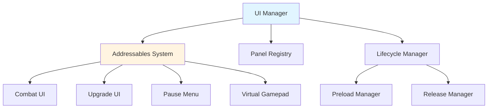

# 🎨 UI System - Documentación

Sistema de UI con carga dinámica via Addressables del proyecto Santa.

---

## Visión General

El UI System usa **Addressables** para cargar panels dinámicamente, reduciendo memoria y permitiendo actualizaciones de contenido.

### Características

- ✅ **Dynamic Loading** - Panels cargados solo cuando se necesitan
- ✅ **Memory Efficient** - Se liberan panels no utilizados
- ✅ **Addressables** - Asset management optimizado
- ✅ **Preloading** - Panels frecuentes preloaded en startup
- ✅ **Lifecycle Management** - Auto release de resources

---

## Arquitectura



---

## Componentes Principales

### UIManager

**Ubicación**: `Presentation/Managers/UIManager.cs`

```csharp
public class UIManager : MonoBehaviour, IUIManager
{
    private readonly Dictionary<string, GameObject> _activePanels = new();
    private readonly Dictionary<string, AsyncOperationHandle<GameObject>> _handles = new();
    
    public async UniTask<GameObject> ShowPanel(string addressableKey)
    {
        // Si ya está activo, retornar
        if (_activePanels.TryGetValue(addressableKey, out var existing))
        {
            existing.SetActive(true);
            return existing;
        }
        
        // Cargar via Addressables
        var handle = Addressables.InstantiateAsync(addressableKey, _panelParent);
        GameObject panel = await handle.Task;
        
        if (panel != null)
        {
            _activePanels[addressableKey] = panel;
            _handles[addressableKey] = handle;
            
            // Inicializar panel si implementa IUIPanel
            if (panel.TryGetComponent<IUIPanel>(out var uiPanel))
            {
                uiPanel.Initialize();
            }
            
            GameLog.Log($"UIManager: Loaded panel '{addressableKey}'");
        }
        
        return panel;
    }
    
    public async UniTask HidePanel(string addressableKey)
    {
        if (!_activePanels.TryGetValue(addressableKey, out var panel))
            return;
        
        panel.SetActive(false);
        
        // Opcional: Release del addressable
        // await ReleasePanel(addressableKey);
    }
    
    public async UniTask ReleasePanel(string addressableKey)
    {
        if (!_activePanels.TryGetValue(addressableKey, out var panel))
            return;
        
        _activePanels.Remove(addressableKey);
        
        if (_handles.TryGetValue(addressableKey, out var handle))
        {
            Addressables.Release(handle);
            _handles.Remove(addressableKey);
        }
        
        Destroy(panel);
        
        GameLog.Log($"UIManager: Released panel '{addressableKey}'");
    }
    
    public void HideAllPanels()
    {
        foreach (var panel in _activePanels.Values)
        {
            panel.SetActive(false);
        }
    }
}
```

---

## Addressable Keys

### AddressableKeys Class

**Ubicación**: `Core/Addressables/AddressableKeys.cs`

```csharp
public static class AddressableKeys
{
    public static class UIPanels
    {
        public const string Combat = "UI_Panel_Combat";
        public const string Upgrade = "UI_Panel_Upgrade";
        public const string PauseMenu = "UI_Panel_PauseMenu";
        public const string VirtualGamepad = "UI_Panel_VirtualGamepad";
        public const string CombatLog = "UI_Panel_CombatLog";
        public const string Settings = "UI_Panel_Settings";
    }
    
    public static class CombatArenas
    {
        public const string Forest = "CombatArena_Forest_01";
        public const string Cave = "CombatArena_Cave_01";
        public const string Dungeon = "CombatArena_Dungeon_01";
    }
    
    public static class VFX
    {
        public const string Explosion = "VFX_Explosion";
        public const string Heal = "VFX_Heal";
        public const string Slash = "VFX_Slash";
    }
}
```

---

## Uso del UI System

### Mostrar Panel

```csharp
public class CombatTransitionManager : MonoBehaviour
{
    [Inject] private IUIManager _uiManager;
    
    public async UniTask TransitionToCombat()
    {
        // Ocultar UI de exploración
        await _uiManager.HidePanel(AddressableKeys.UIPanels.VirtualGamepad);
        
        // Mostrar UI de combate
        GameObject combatUI = await _uiManager.ShowPanel(AddressableKeys.UIPanels.Combat);
        
        // Configurar combat UI
        var ui = combatUI.GetComponent<CombatUI>();
        ui.SetupForCombat(_combatData);
    }
}
```

### Ocultar Panel

```csharp
public async UniTask ExitCombat()
{
    // Ocultar combat UI (sync)
    _uiManager.HidePanel(AddressableKeys.UIPanels.Combat);
    
    // Mostrar exploration UI (async)
    await _uiManager.ShowPanel(AddressableKeys.UIPanels.VirtualGamepad);
}
```

### Liberar Panel

```csharp
// Los panels se liberan automáticamente cuando el UIManager es destruido
// No hay método público ReleasePanel
// Para forzar liberación, simplemente destruye el UIManager o la escena
```

---

## Panel Interface

### IUIPanel

```csharp
public interface IUIPanel
{
    void Initialize();
    void Show();
    void Hide();
    void Cleanup();
}
```

### Implementación de Panel

```csharp
public class CombatUI : MonoBehaviour, IUIPanel
{
    [SerializeField] private CombatUIActionButtons _actionButtons;
    [SerializeField] private CombatLogUI _combatLog;
    [SerializeField] private HealthBarUI _playerHealth;
    [SerializeField] private HealthBarUI _enemyHealth;
    
    private bool _isInitialized;
    
    public void Initialize()
    {
        if (_isInitialized) return;
        
        _actionButtons.Initialize();
        _combatLog.Initialize();
        _playerHealth.Initialize();
        _enemyHealth.Initialize();
        
        _isInitialized = true;
        GameLog.Log("CombatUI: Initialized");
    }
    
    public void Show()
    {
        gameObject.SetActive(true);
        _combatLog.Clear();
    }
    
    public void Hide()
    {
        gameObject.SetActive(false);
    }
    
    public void Cleanup()
    {
        _actionButtons.Cleanup();
        _combatLog.Clear();
    }
    
    public void SetupForCombat(CombatData data)
    {
        _playerHealth.SetTarget(data.Player);
        _enemyHealth.SetTarget(data.Enemy);
        _actionButtons.SetAbilities(data.PlayerAbilities);
    }
}
```

---

## Preloading de Panels

### PreloadUIPanelsEntryPoint

**Ubicación**: `Presentation/Managers/PreloadUIPanelsEntryPoint.cs`

```csharp
public class PreloadUIPanelsEntryPoint : IStartable
{
    private readonly IUIManager _uiManager;
    
    public PreloadUIPanelsEntryPoint(IUIManager uiManager)
    {
        _uiManager = uiManager;
    }
    
    public async void Start()
    {
        // Precargar panels frecuentes
        await Preload();
    }
    
    private async UniTask Preload()
    {
        var tasks = new[]
        {
            _uiManager.ShowPanel(AddressableKeys.UIPanels.VirtualGamepad),
            _uiManager.ShowPanel(AddressableKeys.UIPanels.Combat)
        };
        
        await UniTask.WhenAll(tasks);
        
        // Ocultar combat UI hasta que se necesite
        await _uiManager.HidePanel(AddressableKeys.UIPanels.Combat);
        
        GameLog.Log("PreloadUIPanels: Completed");
    }
}
```

### Registro en VContainer

```csharp
// En GameLifetimeScope.cs
protected override void Configure(IContainerBuilder builder)
{
    // ...
    
    // Preload frequently used panels at startup
    builder.RegisterEntryPoint<PreloadUIPanelsEntryPoint>();
}
```

---

## Lifecycle Management

### UpgradeUILifecycleManager

Ejemplo de lifecycle manager para UI específica:

```csharp
public class UpgradeUILifecycleManager : IStartable, IDisposable
{
    private readonly IUpgradeUI _upgradeUI;
    private readonly IEventBus _eventBus;
    
    public UpgradeUILifecycleManager(IUpgradeUI upgradeUI, IEventBus eventBus)
    {
        _upgradeUI = upgradeUI;
        _eventBus = eventBus;
    }
    
    public async void Start()
    {
        // Preload upgrade UI
        await _upgradeUI.Preload();
        
        // Suscribirse a eventos
        _eventBus.Subscribe<CombatEndedEvent>(OnCombatEnded);
    }
    
    private void OnCombatEnded(CombatEndedEvent evt)
    {
        if (evt.Victory)
        {
            _ = _upgradeUI.Show();
        }
    }
    
    public void Dispose()
    {
        _eventBus.Unsubscribe<CombatEndedEvent>(OnCombatEnded);
        _ = _upgradeUI.Release();
    }
}
```

---

## Configuración de Addressables

### Crear Grupo de UI Panels

1. `Window → Asset Management → Addressables → Groups`
2. Click `Create → Group → Packed Assets`
3. Nombrar: **"UI_Panels"**
4. Configuración recomendada:
   - **Build Path**: LocalBuildPath
   - **Load Path**: LocalLoadPath
   - **Bundle Mode**: Pack Together

### Marcar Prefabs como Addressables

1. Selecciona el prefab del panel (ej: `CombatUI.prefab`)
2. En Inspector, marca **"Addressable"**
3. Asigna Address: `UI_Panel_Combat`
4. Asigna al grupo: **UI_Panels**

### Build Addressables

```
Window → Asset Management → Addressables → Groups
Build → New Build → Default Build Script
```

---

## Best Practices

### ✅ DO's

- **Preload panels frecuentes** en startup para reducir loading times
- **Release panels grandes** cuando no se usen (ej: Upgrade UI después de upgrade)
- **Usar const strings** en AddressableKeys para evitar typos
- **Implementar IUIPanel** para consistencia
- **Testear en dispositivo** para verificar tamaños de asset bundles

### ❌ DON'Ts

- No cargar todos los panels al inicio (desperdicia memoria)
- No usar FindObjectOfType para buscar panels
- No duplicar addressable keys en múltiples grupos
- No olvidar liberar handles cuando destruyes panels manualmente

---

## UI Pooling

Para elementos dinámicos (damage numbers, notifications, etc.):

```csharp
public class DamageNumberSpawner : MonoBehaviour
{
    [Inject] private IPoolService _poolService;
    
    public async void SpawnDamageNumber(int damage, Vector3 worldPosition)
    {
        GameObject damageNum = await _poolService.Get("UI_DamageNumber");
        
        damageNum.transform.position = worldPosition;
        damageNum.GetComponent<DamageNumberUI>().SetDamage(damage);
        
        // Devolver al pool después de animación
        await UniTask.Delay(TimeSpan.FromSeconds(1.5f));
        _poolService.Return("UI_DamageNumber", damageNum);
    }
}
```

---

## Troubleshooting

### Panel no se carga

**Posibles causas**:
- Addressable key incorrecto
- Addressables no construidos
- Asset no marcado como Addressable

**Solución**:
1. Verificar key en `AddressableKeys`
2. Rebuild addressables
3. Verificar que prefab esté marcado correctamente

### Memory leaks

**Si la memoria crece constantemente**:
- Verificar que se llame `Release` para panels no usados
- Usar Profiler para identificar leaks
- Liberar addressable handles correctamente

---

## Ejemplo Completo

```csharp
public class ExampleUIFlow : MonoBehaviour
{
    [Inject] private IUIManager _uiManager;
    
    private async UniTask ShowUpgradeFlow()
    {
        // 1. Mostrar upgrade UI
        GameObject upgradePanel = await _uiManager.ShowPanel(
            AddressableKeys.UIPanels.Upgrade
        );
        
        var upgradeUI = upgradePanel.GetComponent<UpgradeUI>();
        
        // 2. Esperar a que el usuario seleccione upgrade
        var selectedUpgrade = await upgradeUI.WaitForSelection();
        
        // 3. Aplicar upgrade
        ApplyUpgrade(selectedUpgrade);
        
        // 4. Ocultar UI
        await _uiManager.HidePanel(AddressableKeys.UIPanels.Upgrade);
        
        // 5. Liberar (opcional si no se usará pronto)
        await _uiManager.ReleasePanel(AddressableKeys.UIPanels.Upgrade);
    }
}
```

---

**Última actualización**: Enero 2026

Ver también:
- [SYSTEMS.md](SYSTEMS.md#3️⃣-ui-system) - UI system overview
- [ARCHITECTURE.md](ARCHITECTURE.md) - Arquitectura general
- [SETUP.md](SETUP.md) - Configuración de Addressables
